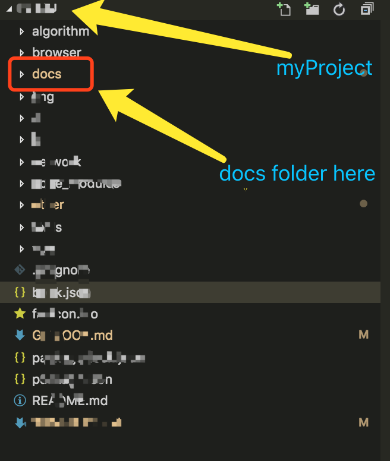
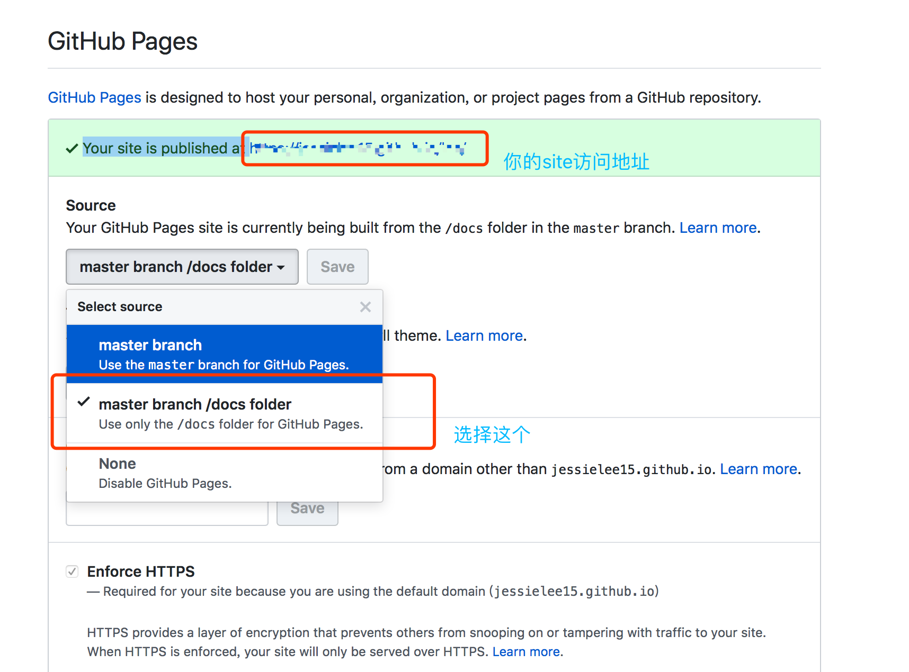

# About Gitbook

## gitbook 指令

### gitbook init
执行 gitbook init 会根据 SUMMARY.md 目录生成对应的文件夹和 md 文件，每一个 md 文件对应每一章节，每一章节的内容在对应的 md 文件里编辑。

如果想要新增章节，可以在 SUMMARY.md 里面新增，然后执行 gitbook init 就会新增对应的 md 文件，原有文件不会变化；如果想要删除章节，在 SUMMARY.md 里面删除，然后执行 gitbook init 想要删除的 md 文件并不会删除，需要手动删除。

### gitbook build
gitbook build . ./output

//output为要输出的目录，不写默认为_book目录

执行 gitbook build 会根据 gitbook init 生成的 md 文件生成对应的 html 文件

### gitbook serve
本地预览，http://localhost:4000

其他配置
新建book.json，可以做一些配置，比如标题，作者，指定readme文件，关闭分享链接等。

---

## Markdown 语法

### 字体
*This text will be italic*
_This will also be italic_

**This text will be bold**
__This will also be bold__

~~This text will be crossed out.~~

_You **can** __combine__ them_

### 换行
a line

a line containing nothing but spaces or tabs is considered blank

### list
* Item 1
* Item 2
  * Item 2a
  * Item 2b


1. Item 1
2. Item 2
3. Item 3
   * Item 3a
   * Item 3b

### link
This is [an example](http://example.com/ "Title") inline link with a title.

[This link](http://example.net/) has no title attribute.

<!-- 定义id -->
[id]: http://example.com/  "Optional Title Here"

This is [an example][id] reference-style link.

### image
An image: 

### blockquotes
As Kanye West said:

> We're living the future so
> the present is our past.

### table
There must be at least three hyphens in each column of the header row.

| First Header  | Second Header |
| ------------- | ------------- |
| Content Cell  | Content Cell  |
| Content Cell  | Content Cell  |

### code
1.four spaces or one tab 

    Continued here.
2.```
<!-- js:语法高亮 -->
```js
function test() {
  console.log("notice the blank line before this function?");
}
```
3.Inline code
Use `gitbook` to convert the `text` in markdown syntax to HTML.

### Footnotes
Text prior to footnote reference.[^2]

[^2]: Comment to include in footnote.

### HTML
<div>
Markdown here will not be **parsed**
</div>

### Horizontal Rule
Three or more...

---

Hyphens

***

Asterisks

### Ignoring Markdown formatting
using `\`

Let's rename \*our-new-project\* to \*our-old-project\*.


---

# Publish Gitbook on GitHub

通过github的GitHub Pages功能

#### 详细发布流程：

1. 本地/源码准备：
  * 在项目目录（一级目录）下新建docs文件夹，用于存放gitbook build 后的网页文件。
  
  * 将gitbook build后的资源放到docs文件夹下（`gitbook build ./ ./docs`），如果没有其他设置，gitbook默认build后的路径在项目目录下的_book下面（此文件一般会被视为编译后文件ignore）
  * 建议使用npm管理项目，可以设置npm相应指令，替代加冗长的gitbook指令，配置参考此源码的package.json

2. 远程GitHub仓库设置：
  * Settings下面设置Repository name，设置好后在后面的GitHub Pages部分就可以看到：Your site is published at ***
  * 在GitHub Pages部分设置source，选择 master branch/docs folder
  

  At last，打开Your site is published at的链接，就可以看到你的gitbook页面啦～


