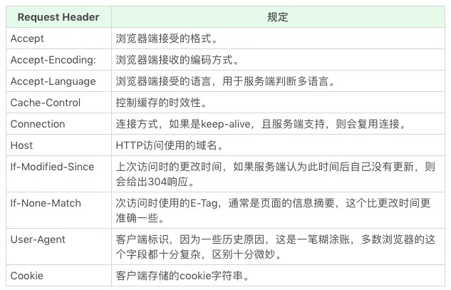
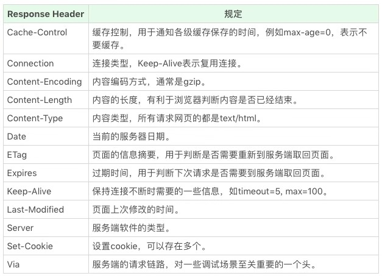
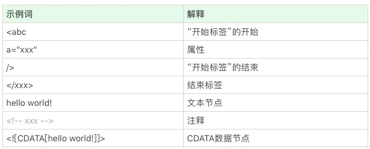
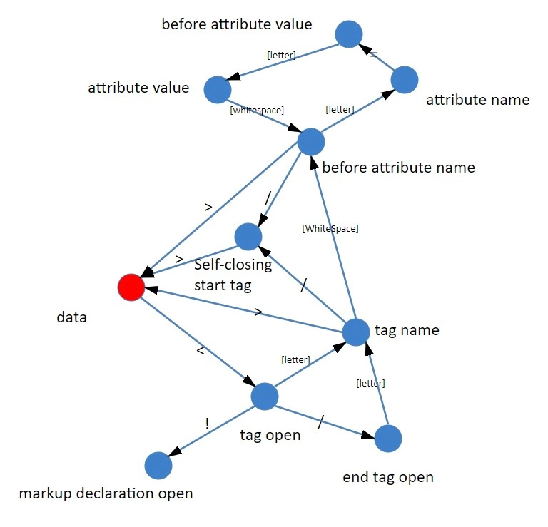

# 浏览器如何工作

1. 浏览器首先使用HTTP协议或者HTTPS协议，向服务器端请求页面；
2. 把请求回来的HTML代码经过解析，构建成DOM树；
3. 计算DOM树上的CSS属性；
4. 最后根据CSS属性对元素逐个进行渲染，得到内存中的位图；
5. 一个可选的步骤是对位图进行合成，这会极大地增加后续绘制的速度；
6. 合成之后，再绘制到界面上。

---
## PART I —— 通讯（请求页面）
### HTTP协议
HTTP协议是基于TCP协议出现的。TCP协议是一条双向通讯通道，HTTP在TCP的基础上，规定了Request-Response模式，这个模式决定了通讯必定是由浏览器端首先发起的。


#### HTTP Method
* GET   浏览器通过地址栏访问页面都是GET方法
* POST  表单提价产生POST方法
* HEAD  跟GET类似，只返回请求头，多数由JavaScript发起
* PUT   添加资源；实际上知识语义上的一种约定，并没有强约束
* DELETE  删除资源；实际上知识语义上的一种约定，并没有强约束
* CONNECT  现多用于HTTPS和WebSocket
* OPTIONS  一般用于调试，多数线上服务不支持
* TRACE    一般用于调试，多数线上服务不支持

#### HTTP Status code 和 Status text
* 1**：临时回应，表示客户端请继续   （被浏览器http库直接处理掉了，不会让上层知晓）
* 2**：请求成功 （200）
* 3**：表示请求的目标有变化，希望客户端进一步处理
  * 301&302：永久性与临时性跳转 （301接近于一种报错，提示客户端下次别来了）
  * 304：跟客户端缓存没有更新 （前提是客户端本地已经有缓存的版本，并在Request中告诉了服务端，当服务端通过时间或者tag，发现没有更新的时候，就会返回一个不含body的304状态）
* 4**：客户端请求错误
  * 403：无权限
  * 404：请求的页面不存在
  * 418：It`s a teapot. 一个彩蛋，来自ietf的一个愚人节玩笑（[超文本咖啡壶控制协议](https://tools.ietf.org/html/rfc2324)）
* 5**：服务端请求错误
 * 500：服务端错误
 * 503：服务端暂时性错误，可以一会儿再试

#### HTTP Head
 可以看作一个键值对。也可以自定义HTTP头和值。HTTP规范中规定的一些特殊的HTTP头：
 * Request Header

 * Response Header


#### HTTP Request Body
一些常见的body格式：
* application/json
* application/x-www-from-urlencoded       html的form标签提交产生的html请求，产生此数据格式
* multipart/from-data                     文件上传时使用
* text/xml

### HTTPS
基本保持了HTTP的设计思想（Request-Response模式）

[RFC规定的标准](https://tools.ietf.org/html/rfc2818)

HTTPS使用加密通道来传输HTTP的内容。首先与服务器建立一体TLS加密通道。TLS构建于TCP协议之上，它实际上时对传输内容做一次加密，所以内容上，HTTPS跟HTTP没有任何区别

两个作用：
* 确认请求的目标服务端身份
* 保证传输的数据不会被网络节点中间节点窃听或者篡改

### HTTP2 
是HTTP1.1的升级版本，[详情](https://tools.ietf.org/html/rfc7540)

最大改进：
* 支持服务端推送
* 支持TCP连接复用


## PART II —— 解析HTML代码 & DOM树的构建

### 解析代码 （把字符流变成token）

#### 拆分词（token）
```html
<p class="a">text text text</p>
```
拆分成：
* <p “标签开始”的开始
* class="a" 属性
* /> “标签开始”的结束
* text text text 文本
* </p> 结束标签

常见的token：



__过程：__

在接收第一个字符之前，我们无法判断这是哪一个token，不过，随着接收的字符越来越多，频出其他内容可能性就越来越少；

每读入一个字符，其实都要做一次决策

这些决定是跟“当前状态”有关的 （状态机）

#### 状态机
绝大多数语言的词法部分都是用状态机实现的

参考[HTML官方文档](https://html.spec.whatwg.org/multipage/parsing.html#tokenization), 官方文档规定了80个状态。。。
粗略的token解析状态机图：

__实现状态机：__

C/C++和JavaScript中大同小异：把每个函数当作一个状态，参数是接收的字符，返回值是下一个状态函数 。。。

### 构建DOM树 - 栈

在完全符合标准的浏览器中，不一样的HTML节点对应了不同的Node的子类

简单思路：
* 栈顶元素就是当前节点
* 遇到属性，就添加到当前节点
* 遇到文本节点，如果当前节点就是文本节点，则跟文本节点合并，否则入栈成为当前节点的子节点
* 遇到注释节点，作为当前节点的子节点
* 遇到tag start就入栈一个节点，当前节点就是这个节点的父节点
* 遇到tag end就出栈一个节点（检查是否匹配）


[tag start和tag end匹配检查规则](http://www.w3.org/html/wg/drafts/html/master/syntax.html#tree-construction)


## PART III —— CSS规则添加到DOM树的构建

添加时间： DOM树构建同时

过程：
* CSS规则处理：词法分析和语法分析（编译原理），cssom(css Object Model)，得到抽象的语法树cssdom
* cssom有rule和view部分。rule部分在dom开始之前就构建完成，view是跟着dom同步构建的
* 解析标签的同时去匹配规则，不同的css选择器规则对应不同的算法


## PART IV —— 元素位置

### 排版
* 浏览器最基本的排版方式是正常流排版，包含了顺次排布和折行等规则。
* 浏览器的文字排版遵循公认的文字排版规范，文字排版是一个复杂的系统，规定了行模型和文字在行模型中的排布。还要支持双向文字系统
* 浏览器又支持元素和文字的混排，元素被定义为占据长方形的区域，还允许边框、边距和留白，这就是盒模型。
* 在正常流的基础上，浏览器还支持两类元素：绝对定位和浮动元素
  * 绝对定位：把自身从正常流抽出，直接由top和left等属性确定自身的位置，不参加排版计算，也不影响其他元素。由position属性控制
  * 浮动元素：使得自己在正常流的位置向左或向右移动到边界，并且占据一块排版空间。由float属性控制
* 浏览器还支持其它排版方式，比如flex排版。这些排版方式由外部元素的display属性来控制（注意：display还控制元素在正常流中属于inline等级还是block等级）

#### 正常流
正常流是唯一一个文字和盒混合的排版方式

文字。。。

盒。。。

#### 绝对定位元素
需要根据它的包含块来确定位置，这是完全跟正常流无关的一种独立排版模式，逐层找到其父级非static元素即可

#### 浮动元素的排版
float元素非常特别，浏览器的处理是：先排入正常流，再移动到排版宽度的最左/右（主轴的最前/后）；

float元素排布完成后，该元素所在的行需要重新确定位置

#### 其它排版
flex table grid...

css的每一种排版都有一个很复杂的规定，实际实现形式也各有不同，都有各自的标准。如flex，flex属性将每一行排版后的剩余空间平均分配给主轴方向的width/height属性。


## PART V —— 渲染 绘制

### 渲染
* 渲染（render）在图形学中的意义：把模型变成位图的过程
  * 此处的位图：内存中建立的二维表格，把一张图片的每个像素对丁的颜色保存进去（位图信息也是DOM树中占据浏览器内存最多的信息，在做内存占用优化时，是主要考虑的点）
* 浏览器的渲染过程，就是把每一个元素（HTML元素和伪元素）对应的盒变成位图。一个元素可能对应多个盒（inline元素折行），一个盒对应一张位图
* 浏览器的渲染可以分为图形和文字两大类。都需要底层库的支持
  * 盒的特性的绘制（北京、边框、SVG元素、阴影、圆角、虚线），每一个都有对应的标准规定，每一个都可以作为一个独立课题研究
* input、用户选择、鼠标事件、scroll： “热区”。。。

### 合成 composition

性能考量，并非实现浏览器的必要一环

合成策略

主浏览器一般根据position、transform等属性来决定合成策略，“猜测”元素未来可能发生变化；

新的CSS标准中，规定了will-change属性，可以由业务代码来提示浏览器的合成策略。

### 绘制
浏览器并不需要用代码来处理这个过程，只需要把最终要显示的位图交给操作系统即可

重绘：脏矩形。。。


考虑重绘、重排、交互。。。。。阔怕

玩具浏览器～


