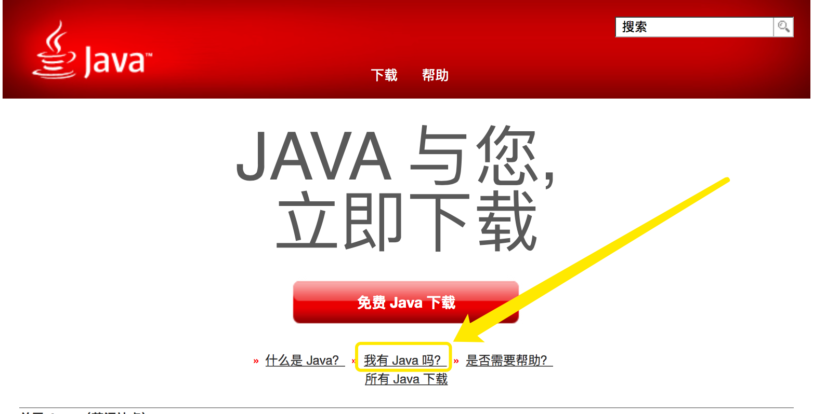

## FIS
### server：
    fis server start
    fis server stop
    fis server open

### fis release

默认目录：~/.fis-tmp

#### 参数：
    --optimize / -o

资源压缩，仅仅是压缩！！！去空格及换行符啥的

    --md5 / -m

为静态资源加版本号，类似于时间戳啦～（以前手动在引入文件后面手动加过?time=20170619这种时间戳的🙋）,

但是这个跟时间戳还是有本质的区别的。可以理解为时间戳只是一个URL的属性，但是md5是URL的一部分（这个后缀好像是根据消息摘要算法得出的跟文件内容相关的）

    --pack / -p

资源合并（依赖fis-postpackager-simple插件打包）安装插件、fis_conf中配置打包规则并开启插件
也可开启自动合并

    --omp

---

## FIS3
> 项目根目录：FIS3 配置文件（默认fis-conf.js）所在的目录为项目根目录。

### 特点
1.资源定位：就是构建的时候会替换资源URL为绝对URL；这样开发就不需要关心外部路径，构建后的程序可移植性强

2.

### server：
    fis3 server start
    fis3 server stop
    fis3 server open

### fis3 release
默认目录：~/.fis3-tmp

#### 参数：

### fis-conf
1.

    fis.match(selector, props); //后面覆盖前面，属性追加

    useHash: true   //添加 md5 戳
    optimizer:  //压缩

2.

    fis.media() //多种状态功能，比如有些配置是仅供开发环境下使用，有些则是仅供生产环境使用的。

3.

    fis3 inspect <media>    // 查看特定 media 的分配情况

### 发布远端
FIS3 默认支持使用 HTTP 上传代码，首先需要在测试机部署上传接收脚本（或者服务）

---

## FISP

### 环境配置

#### Java环境
来说一说配置本地调试环境中踩的坑坑坑吧～（一切基于 MAC）

mac安装Java环境非常简单，直接打开[官网](https://java.com/zh_CN/)一个大大的button（免费Java下载）点击下载安装

如图，安装后可以根据这个看看是否安装成功

那么问题来了，这边测试安装成功了，在`fisp server start`的时候还是会报没有Java环境，提示你安装的。。。。。

然后找啊找

问题的原因呢，Java官方给解释了（细心找找就会发现的），Mac系统在macOS Sierra (10.12)之后会与Java的最新版本有不兼容的地方，至于哪里、为什么，请[看这里](https://java.com/zh_CN/download/faq/yosemite_java.xml)

解决办法：（敲黑板）去[这里](https://support.apple.com/kb/DL1572?locale=zh_CN)下载这个版本的Java安装，就可以啦

个人没有测试过直接安装这个版本可不可以哈。。。

说明&总结：
 * 此问题我发现于2018-6-29，以后Java发版本肯定是会考虑这个问题的；此时这个问题官方给的解释是适用于Java版本：7.0, 8.0
 * 这件事告诉我们，遇到问题呢，仔细看官方文档、Q&A、help之类的啊，像Java、Mac这样优秀的产品会分分钟考虑到用户的，你的问题，潜在的问题一般都会考虑到并给你解答的，我们要做的就是冷静，慢慢分析
 * 更多的启示：我们做产品的时候也要学习这种严谨，责任，注重用户体验的精神！！！

#### PHP环境
官方说要安装php-cgi

好吧，根据官方说的步骤安装php55（brew安装）

现在的日期是2018-6-29，php55已经out了，安装的时候应该会各种报错的，说是找不到。。。。`Error: No available formula with the name "php55"` （人家各种searching都没找到，我也不好吐槽啥了。。。😂）

好吧，那么我就安装现在能找得到的吧，所以装了个php70（这个php后面的数字是我猜的应该是跟版本号相关的哈。。。实际是不是没有深究）

OK，安装成功

上面的step把Java的问题解决了，然后再次`fisp server start`，尼玛！！！unsupported php-cgi environment 😔

so，我还必须得安装php55😭😭😭

[解决方案](https://www.jianshu.com/p/e58e8f52da13)

[^N2018-06-19]: 宠辱不惊，闲看庭前花开花落；去留无意，漫随天外云卷云舒。