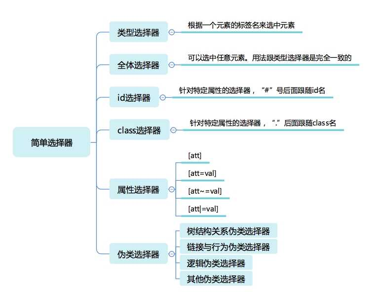
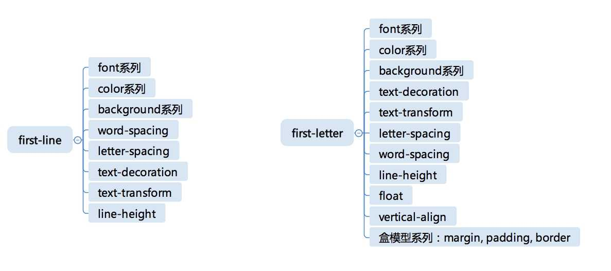

# CSS 选择器

选择器是CSS最先引入的一个机制（但是随着document.querySelector等API的加入，选择器已经不仅仅是CSS的一部分了）

### 基础
基本意义： 根据一些特征，选中元素树上的一批元素

选择器结构分类：
  * 简单选择器：针对某一特征判断是否选中元素
  * 复合选择器：连续写在一起的简单选择器，针对元素自身特征选择单个元素
  * 复杂选择器：由空格、>、～、+、||等符号链接的复合选择器，根据父元素或者前序元素检查单个元素
  * 选择器列表：由逗号分隔的复杂选择器，表示“或”的关系

#### 一、简单选择器

  

  * 类型选择器和全体选择器
    * 全体选择器： *
    * 类型选择器：根据元素的标签名来选中元素
      * 必须考虑html或xml的命名空间问题
      ```html
      <!-- html和svg中都有a元素，用带命名空间的类型选择器来区分 -->
      <!DOCTYPE html>
      <html>
      <head>
        <meta charset="utf-8">
        <title>JS Bin</title>
      </head>
      <body>
      <svg width="100" height="28" viewBox="0 0 100 28" version="1.1"
          xmlns="http://www.w3.org/2000/svg" xmlns:xlink="http://www.w3.org/1999/xlink">
        <desc>Example link01 - a link on an ellipse
        </desc>
        <a xlink:href="http://www.w3.org">
          <text y="100%">name</text>
        </a >
      </svg>
      <br/>
      <a href=" ">name</a >
      </body>
      </html>

      @namespace svg url(http://www.w3.org/2000/svg);
      @namespace html url(http://www.w3.org/1999/xhtml);
      svg|a {
        stroke:blue;
        stroke-width:1;
      }

      html|a {
        font-size:40px
      }
      ```
  * id选择器和class选择器：针对特定属性
    * 注：class选择器识别的是 - 用空格分隔的class语法
  * 属性选择器：根据HTML元素的属性来选中元素
    * 四种形态：
      * [att]：直接在方括号中放入属性名，是检查元素是否具有这个属性，只要有，不论什么值，都可以被选中
      * [att=val]：精确匹配，检查一个元素的属性值是否是val
      * [att~=val]：多种匹配，检查一个元素的属性值是若干值之一，此处的val不是一个单一值，可以是用 __空格__ 分隔的一个序列
      * [att|=val]：开头匹配，检查一个元素的属性值是否以val开头
    * __有些HTML属性有特殊字符，可以用括号把val括起来，形成一个CSS字符串。CSS字符串允许使用引号来规避特殊字符，也可以使用反斜杠转义__
  * 伪类选择器：一系列由CSS规定好的选择器，以冒号开头，有普通类型和函数类型两种
    建议只在不得不使用伪类的场景使用伪类，对于CSS代码的性能和可读性都有好处
    * 树结构关系伪类选择器
      * :root 表示树的根元素。针对完整的html文档情况，一般用html标签即可选中；但在scoped css和shadow root等场景中，选择器可以针对某一子树来选择
      * :empty 表示没有子节点的元素，例外：子节点为空白文本节点的情况
      * :nth-child 和 :nth-last-child 这是函数型的伪类，后者是从后往前数，CSS的 An+B 语法设计的是比较复杂的，eg:
        * :nth-child(even) 选中偶数节点
        * :nth-child(4n-1) 选中第3个、第7个、第11个。。。
        * :nth-child(3n+1 of li.important) 选中第1个、第4个、第7个li.important(注意这里只有li.important会被计数)
      * :first-child :last-child分别表示第一个和最后一个元素
      * :only-child 选中唯一一个子元素
      * of-type系列 是一个变形的语法糖，S:nth-of-type(An+B) 是 :nth-of-type(|An+B| of S)的另一种写法
      * nth-last-of-type、first-of-type、last-of-type、only-of-type
    * 链接与行为伪类选择器：是第一批设计出来的伪类，也是最常用的一批
      * :any-link 表示任意的链接，包括a、area、link都可能匹配到这个伪类
      * :link 表示未访问过的链接，:visited 表示已经访问过的链接
      * :hover 表示鼠标悬停在上的元素
      * :active 表示用户正在激活这个元素。如果用户按下按钮，鼠标还未抬起时，这个按钮就处于激活状态
      * :focus 表示焦点落在这个元素上
      * :target 用于选中浏览器URL的hash部分所指的元素
    * 逻辑伪类选择器
      * :not 函数型伪类
    * 其它伪类选择器
      * 国际化/多语言：dir、lang
      * 音/视频：paly、pause 用于区分音视频播放状态
      * 时序：current、past、future 用于配合读屏软件等时序性客户端的伪类
      * 表格：nth-col、nth-last-col 用于处理table的列的伪类
    * Selector Level 4草案：target-within、focus-within等，表示父容器；:is、:where、:has等；（但是有些违背了 __选择器匹配DOM树不回溯的原则__ ，命运未知）
    
#### 二、选择器的组合
  选择器组合是一个选择器列表，

  选择器列表是用逗号分隔的复杂选择器序列；

  复杂选择器序列是用空格、大于号、波浪线等符号链接的复合选择器；

  复合选择器是连写的简单选择器组合

* 选择器的连接方式可以理解为像四则运算一样有优先级
  * 第一优先级：无连接符号
  * 第二优先级：空格、～、+、>、||
  * 第三优先级：逗号


1. 复合选择器是且的关系

2. 复杂选择器：针对节点关系的选择，规定了五种连接符号：（实践中一般采用合理设置class的方式，避免使用过于复杂的选择器结构，有利于维护和性能）
  * 空格：后代，表示选中所有符合条件的后代节点
  * >：子代，表示选中符合条件的子节点
  * ～：后继，表示选中所有符合条件的后继节点 （后继节点：跟当前节点具有同一个父元素，并出现在它之后的节点）
  * +：直接后继，表示选中符合条件的直接后继节点 （直接后继节点：即nextSibling）
  * ||：列选择器，表示选中对应列中复合条件的单元格

* 伪元素选择器见👇

#### 三、选择器的优先级
* CSS标准用一个三元组（a、b、c）来构成一个复杂选择器的优先级
  * id选择器的数目记为a
  * 伪类选择器和class选择器数目记为b
  * 伪元素选择器和标签选择器数目记为c
  * * 不影响优先级
* CSS标准建议用一个足够大的进制，获取“a-b-c”来表示选择器优先级，即 ```specificity = base * base * a + base * b + c``` ，base是一个足够大的正整数
* 行内属性的优先级永远高于CSS规则
* !important 用法非常危险，相当于一个新的优先级，并且高于行内属性
* 同一优先级：遵循“后面的覆盖前面的”原则
* 注：选择器的优先级是针对复杂选择器的优先级，选择器列表不会合并计算优先级

实践建议： 不要用过于复杂的选择器
  * 根据id选单个元素
  * class、class组合选成组元素
  * tag选择去确定页面风格

* 伪元素选择器：不单单是一种选择规则，还是一种机制
  * 语法跟伪类类似，但实际效果却是把不存在的元素硬选出来
  * 目前兼容性达到可用的伪元素：::first-line、::first-letter、::before、::after
    * ::first-line、::first-letter：分别表示元素的第一行（排版后显示的第一行，跟HTML代码中的换行无关），元素的第一个字母（eg：首字母变大并向左浮动）
      * CSS标准规定了first-line必须出现在最内层的块级元素之内
      ```html
      <div>
        <p id=a>First Paragraph</p>
        <p>Second Paragraph</p>
      </div>
      div>p#a { color: green; }
      div::first-line { color: blue; }
      <!-- 结果为蓝色 p换成span为绿色-->
      ```
      * first-letter位置在所有标签之内
      * CSS只要求::first-line、::first-letter实现有限的几个CSS属性：
        
    * ::before、::after：不是在已有的内容上套一个元素，而是真正的无中生有，造出一个元素


