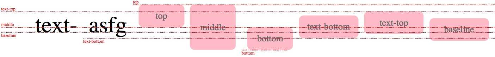

# css 排版-正常流

## 理解

行为：依次排列，排不下了换行

float规则：一些盒占据了正常流需要的空间

vertical-align规则：

margin折叠：margin-一个元素规定了自身周诶至少需要的空间

### 原理

在CSS辨准中，规定了如何排布每一个文字或者盒的算法，这个算法依赖一个排版的“当前状态”，CSS称之为“格式化上下文（formatting context）”

排版过程： 格式化上下文 +  盒/文字 = 位置

盒氛围块级盒和行内级盒。分别为他们规定了块级格式化上下文盒行内级格式上下文

正常流中一个盒或文字排版：
  * 当遇到块级盒： 排入块级格式化上下文
  * 当遇到行内级盒或文字：首先尝试排入行内级格式上下文；如果排不下，创建一个行盒（块级）先将行盒排版，行盒会创建一个行内格式化上下文
  * 遇到float盒：把盒的顶部跟当前行内级上下文上边缘对齐，然后根据float的方向把盒的对应边缘对到块级格式化上下文的边缘，之后重排当前盒

一些元素会在其内部创建新的块级格式化上下文：
  1. 浮动元素
  2. 绝对定位元素
  3. 非块级但仍能包含块级元素的容器（inline-blocks, table-cells, table-captions）
  4. 块级的能包含块级元素的容器，且属性overflow不为visible