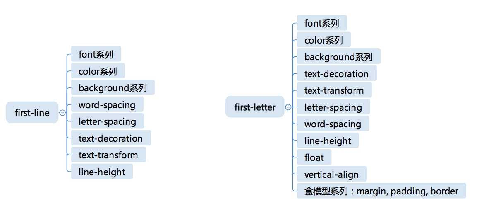

# html-标签

# 标签
* head里面的元信息类（title meta style link base）：描述文档的基本信息
* 语义类（section nav 类div）
* 替换类（img video audio）
* 表单类 （input button）
* 表格类
* ...

## 元信息类标签
* 描述自身的信息，HTML用于描述文档自身的一类标签，常出现在<head></head>中，一般都不会在页面被显示出来（其他标签描述的是业务）
* 多数情况是给浏览器、搜索引擎等机器阅读的；这些信息有时会在页面之外显示给用户，有时则不会

### 逐一介绍：
> head
  * 本身不携带任何信息，主要作为容器
  * 规定自身必须是html标签中的第一个标签
  * 其内容必须包含一个title(如果作为iframe，或其他方式指定了标题，可不包含)，最多只能包含一个base

> title
  * 作为元信息，可能会被用在浏览器收藏夹、微信推送卡片、微博等场景（上下文缺失，title应完整概括整个网页内容）
  * headding(h1 - h6)：用于页面展示，可默认有上下文，有链接辅助，可简写

> base
  * 历史遗留标签，给页面上所有URL相对地址提供一个基础
  * 最多只有一个，改变全局的链接地址（dangerous），实际开发中建议用javascript代替他

> meta
  * 一组键值对，它是一种通用的元信息表示标签
  * 可任意多个。
  * 一般由name（元信息的名）和content（元信息的值）两个属性来定义
    * name：约定比较自由，http规定了一些作为大家使用的共识，也鼓励大家发明自己的name
  * meta的一些变体：简化书写或声明自动化行为
    * 具有charset属性的meta（无需再有name和content）
      * ```<meta charset="UTF-8" >```
      * 描述了HTML文档自身的编码形式，建议放在head的第一个
    * 具有 http-equiv属性的meta
      * 表示执行一个命令（不需要name属性了）
      * ```<meta http-equiv="contant-type" content="text/html; charset=UTF-8" > ``` 相当于添加了content-type这个http头，并制定了http编码方式
      * 其他命令： 
        * content-language 指定类容的语言
        * default-style 指定了默认样式表
        * refresh 刷新
        * set-cookie 模拟http头set-cookie，设置cookie
        * x-ua-compatiable 模拟http头x-ua-compatiable，声明ua兼容性
        * content-security-policy 模拟http头content-security-policy，声明内容安全性
    * name 为 viewport 的meta
      * 没有在HTML标准中定义，确是移动端开发的事实标准
      * 它的content是一个复杂结构，用逗号分隔的键值对，格式是key=value
      * eg： ```<meta name="viewport" content="width=500, initial-scale=1" >
        * width/height：页面宽度/高度，具体数字或device-width/device-height，表示跟设备宽度/高度相等
        * initial-scale：初始化缩放比例
        * minimum-scale：最小缩放比例
        * maximum-scale：最大缩放比列
        * user-scalable：是否允许用户缩放（已经做好移动端适配的网页，应该把用户缩放功能禁止掉，宽度为设备宽度）
      * 一个标准的meta：```<meta name="viewport" contant="width=device-width,initial-scale=1,maxinum-scale=1,user-scale=no">```
    * 其他预定义的meta
      * applica-name: 应用名称
      * author: 页面作者
      * description: 页面描述（用于搜索引擎等）
      * generator: 生成页面使用的工具，主要用于可视化编辑器（手写的不需要）
      * keywords: 页面关键字，SEO
      * referrer: 跳转策略，一种安全考量
      * theme-color: 页面风格颜色，实际不会影响页面，浏览器可能据此调整页面之外的UI


###  补充（杂）
  ``` html
  <!-- 默认使用最新浏览器 -->
  <meta http-equiv="X-UA-Compatible" content="IE=edge,chrome=1">

  <!-- 不被网页（加速）转码 -->
  <meta http-equiv="Cache-Control" content="no-siteapp">

  <!-- 搜索引擎抓取 -->
  <meta name="robots" content="index,follow">

  <!--  删除苹果默认的工具栏和菜单栏 -->
  <meta name="renderer" content="webkit">
  <meta name="viewport" content="width=device-width,initial-scale=1,maximum-scale=1,minimum-scale=1,user-scaleble=no,minimal-ui">
  <meta name="apple-mobile-web-app-capable" content="yes">

  <!-- 设置苹果工具栏颜色 -->
  <meta name="apple-mobile-web-app-status-bar-style" content="black-translucent">
  ```

* 第三方分享： 
  * Open Graph 标签组，包括title、type、URL、site_name、description和image，为Facebook分享提供信息；
  * Twitter 标签组，包括card、title、description和image，为Twitter分享提供信息；
  * msapplication 标签组，包括TitleColor和TitleImage，为Windows8以及以上系统识别favicons用

* format-detection: 禁止iPhone自动识别（ios的webview的一种特性，针对长串的数字符合手机号、电话就自动识别成可拨号链接，然后标成绿色）
  ```<meta name="format-detection" content="telephone=no,date=no,address=no,email=no,url=no"/>```


 


## 语义类标签

* div和span：在“界面场景”中，直接使用
* 其他语义类标签：多用可能效果不好（冗余 增加嵌套） 分场景使用
  * 对开发者友好，可读性
  * 文字表现力丰富，SEO 读屏软件

#### W3C 上的说明
定义和用法：

以下元素都是短语元素。虽然这些标签定义的文本大多会呈现出特殊的样式，但实际上，这些标签都拥有确切的语义。

我们并不反对使用它们，但是如果您只是为了达到某种视觉效果而使用这些标签的话，我们建议您使用样式表，那么做会达到更加丰富的效果。

用对 > 不用 > 用错

### eg
作为自然语言和纯文本的补充，用来表达一定的结构或消除歧义

* ruby：和善美好（shangxinbingkuang） ``` <ruby></ruby> <rt></rt> <rp><rp>```
* 必要的标签：表达意思 ```<em></em>```
  * ```<em> ```标签告诉浏览器把其中的文本表示为强调的内容。对于所有浏览器来说，这意味着要把这段文字用斜体来显示。最好还是不要滥用强调。
  * ```<strong>``` 标签和 ```<em>``` 标签一样，用于强调文本，但它强调的程度更强一些。如果常识告诉我们应该较少使用 ```<em>``` 标签的话，那么 ```<strong>``` 标签出现的次数应该更少。

作为标题摘要    ```<h></h> <hgroup></hgroup> <section><section>(h5)```
* 自动生成目录结构 （HTML标准中还专门规定了生成目录结构的算法）

作为整体结构
* 浏览器的“阅读模式”


## 有关链接的标签

HTML中有两种类型： 超链接型标签、外部资源链接


### link标签 ：：： 也是元信息类的标签之一

link 标签会生成一个链接，它可能生成超链接，也可能生成外部资源链接 其类型主要通过rel属性来区分
  * 生成超链接：浏览器不产生任何作用；但是能够被搜索引擎和浏览器插件识别【RSS订阅】
    * 超链接类：一种被动型链接（用户不操作，不会被主动下载）
        * ref="canonical": 提示主URL【常给搜索引擎用】
        * ref="alternate": 提示页面的变形形式【常给搜索引擎用】
        * ref="pre"/ref="next": 很多网页都属于一个序列【分页、图片浏览】；
        * 其他：表示一个跟当前文档相关联的信息，可以视为一种带功能连接的meta标签
          * ref="author"：链接到本页面的作者，一般是mailto:协议
          * ref="help"：链接到本页的帮助页
          * ref="licence"：链接到本页的版权信息页
          * ref="search"：链接到本页的搜索页（）一般是站内提供搜索时使用
  * 引用外部资源：【引入样式表】；还可被放在body中（非元信息类）
    * 外部资源型link：会被主动下载
      * icon型link：唯一一个外部资源类的元信息link（其他都是超链接） 
        * 如果没有指定此link，多数浏览器会使用域名根目录下的favicon.ico，即使他不存在
        * HTML标准允许一个页面出现多个icon型link，并且用size指定他适合的icon尺寸【只有icon型link有有效的size属性】
      * 预处理型link：允许我们控制刘安琪，提前针对一些资源去做一些操作以提高性能（DNS查询域名、建立连接、传输数据、加载进内存、渲染）
        * dns-prefetch型link：提前对一个域名做DNS查询，这样的link里面的ref实际上只有域名有意义
        * preconnect型link：提前对一个服务器建立tcp链接
        * prefetch型link：提前取href指定的url内容
        * preload型link：提前加载href指定的url
        * prerender型link：提前渲染href指定的url
      * modulepreload型link：预加载一个JavaScript模块【保证JS模块不必等到执行时才加载】；只是下载并加入内存，并不会执行对应的JavaScript
      * stylesheet型link：最常见。
        * 从一个CSS文件创建一个样式表。type属性可以没有，有则必须是"text/css"
        * 可以rel="alternate stylesheet"，此时必须指定title属性：为页面创建一份变体样式【大部分浏览器不支持；Firefox3.0支持动浏览器菜单中切换这些样式】
      * pingback型link：表示本网页被引用时，应该使用的pingback地址（这个机制是一份独立的标准，遵守pingback协议的网站在引用本页面时，会向pingback url发送一个消息）

### a 标签【anchor 锚点】

同时充当了链接和目标点的角色（有href属性-链接【被动型】；有name属性-链接的目标）
  * a标签也可以有ref属性
    * 与link相同的：alternate、author、help、license、next、prev、search
      * 跟link语义完全一致
      * a标签产生的链接会实际显示在网页中，link标签仅仅是元信息
    * a标签独有的rel类型：
      * tag：本网页所属的标签
      * bookmark：到上级章节的链接
    * 一些辅助的rel类型，提示浏览器或搜索引擎做一些处理
      * nofollow： 此链接不会被搜索引擎索引
      * noopener：此链接打开的网页无法使用opener来获得当前页面的窗口【window.opener=null】
      * noreferrer：此链接打开的网页无法使用referrer来获得当前页面的url
      * opener：此链接打开的网页可以使用opener来获得当前页面的window对象，这是a标签的默认行为

### area 标签：：：与a标签相似；但不是文本类型的链接，而是区域型的链接；支持的rel与a完全一样
    
area 标签是整个html规则中唯一支持非矩形热区的标签
  * 其shape属性支持三种类型：
    * 原形 ：circle/circ，coords支持三个值：中心点的x,y坐标和半径r
    * 矩形：rect/rectangle，coords支持两个值：两个对角顶点x1,y1和x2,y2  ？？？
    * 多边形： poly/polygon，coords至少包括6个值：表示多边形的各个顶点
  * 不支持曲线路径
  * area必须跟img和map标签配合使用，eg:
  ```html
    <p>
      Please select a shape:
      
      <map name="shapes">
        <area shape=rect coords="50,50,100,100"> <!-- the hole in the red box -->
        <area shape=rect coords="25,25,125,125" href="red.html" alt="Red box.">
        <area shape=circle coords="200,75,50" href="green.html" alt="Green circle.">
        <area shape=poly coords="325,25,262,125,388,125" href="blue.html" alt="Blue triangle.">
        <area shape=poly coords="450,25,435,60,400,75,435,90,450,125,465,90,500,75,465,60"
              href="yellow.html" alt="Yellow star.">
      </map>
    </p >
  ```


## 替换型元素标签

替换型元素：使用src来引用文件

### script标签
既可以作为替换型标签，又可以不作为替换型标签

### img标签

只作为非替换型标签，一般要有src属性才有意义，其他属性：
* data uri：作为图片的src
  ```html 
    <rect width="300" height="100" style="fill:rgb(0,0,255);stroke-width:1;stroke:rgb(0,0,0)"/></svg>'/>
  ```
* width/height：指定宽高。注：只指定其一：图片被等比缩放。【从性能考虑，建议同时设置，替换型元素加载完文件后，如果尺寸改变，会触发重排版】
* alt：对于视障用户非常重要
* srcset和sizes：是src属性的升级版-在不同屏幕大和特性下，使用不同的图片源。其实更好的做法：使用picture元素
  ```html
  
  ```
### picture标签

可以根据屏幕条件为其中的img提供不同的源：
  ``` html
  <picture>
    <source srcset="image-wide.png" media="(min-width: 600px)">
    
  </picture>
  ```
* 其设计跟audio和video保持一致
* 使用source元素支持图片源，可以设置多个
* media属性：media query，同css的@media

### video标签

H5早期设计中，同img类似，使用src属性引入源文件。【浏览器对视频的编码格式兼容问题】现在同picture一样，提倡使用source
  ```html
  <video controls="controls" >
    <source src="movie.webm" type="video/webm" >
    <source src="movie.ogg" type="video/ogg" >
    <source src="movie.mp4" type="video/mp4">
    You browser does not support video.
  </video>
  ```
* source支持media属性
* source支持type属性：区分源文件的使用场景
* video内还支持标签track（可有多个）：一种播放时序相关的标签，常用于字幕。
  * 必须使用srclang属性来指定语言
  * kind属性：
    * subtitles：字幕，不一定是翻译，也可能是补充性说明
    * captions：报幕内容（可能包含演员职员表等元信息，适合听障人士或没打开声音的人了解音频内容）
    * descriptions：视频描述信息
    * chapters：用于浏览器视频内容
    * metadata：给代码提供的元信息，对普通用户不可见

### audio标签

同picture和video，没啥历史兼容问题，使用src也是推荐的

# iframe标签

嵌入一个完整网页，但是不推荐使用
* 移动端无法指定大小，内容会被完全平铺到父级页面上
* 是各种安全问题的重灾区：opener、window.name、css的opacity等等
* 新标准中，加入了sandbox模式和srcdoc属性

