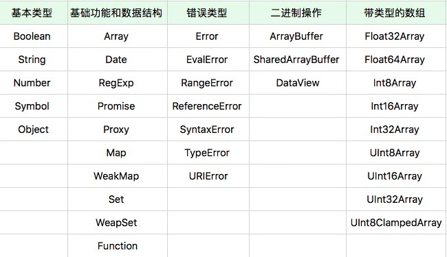

# 对象

## 面向对象 VS 基于对象
> 为什么JavaScript（直到ES6），有对象的概念，但是没有类的概念？
> 为什么JavaScript中对象可以自由添加属性，其他语言不可以？

### Objet
* 一切事物的总称
* 描述对象： 类（C++、Java） VS 原型（JS）
* 政治原因：JS创始人在“原型运行时”的基础上引入new、this等语言特性，使之“看起来更像像Java”

### JavaScript对象的特征

#### 对象的本质特征 《面向对象分析与设计》Grandy Booch
* 对象具有唯一标识性：即使完全相同的两个对象，也并非同一个对象 （一般用内存地址体现）
* 对象有状态：（C++：成员变量；Java：属性；JS：属性）
* 对象具有行为：（C++：成员函数；Java：方法；JS：属性）

__JavaScript对象具有高度动态性，JavaScript对象赋予了使用者在运行时为对象添改状态和行为的能力__

#### JavaScript对象的两类属性
对于JavaScript，属性并非简单的名称和值，JavaScript用一组特征（attribute）来描述属性（property）

__一、数据属性 四大特征__：
* value：属性值
* writeable：决定属性能否被赋值
* enumerable： 决定for in能否枚举该属性
* configurable： 决定该属性能否被删除或改变特征值

可以使用内置函数Object.getOwnPropertyDescriptor来查看数据属性
```js
var o = { a: 1 };
o.b = 2;
//a b皆为数据属性
Object.getOwnPropertyDescripteor(o, "a"); //{value: 1, writeable: true, enumerable: true, configurable: true}
Object.getOwnPropertyDescripteor(o, "b"); //{value: 2, writeable: true, enumerable: true, configurable: true}
```

__二、访问器（gutter/setter）属性 四大特征__：
* getter：函数或undefined，取属性值时被调用
* writeable：函数或undefined，设置属性值时被调用
* enumerable： 决定for in能否枚举该属性
* configurable： 决定该属性能否被删除或改变特征值

可以使用Object.defineProperty来改变属性特征或定义访问器属性
```js
var o = { a: 1 };

Object.defneProperty(o, 'b', {value: 2, writeable: false, enumerable: false, configurable: true})
//a b皆为数据属性, 但b特征值不为默认值
Object.getOwnPropertyDescripteor(o, "a"); //{value: 1, writeable: true, enumerable: true, configurable: true}
Object.getOwnPropertyDescripteor(o, "b"); //{value: 2, writeable: false, enumerable: false, configurable: true}
o.b = 3; //writeable: false
console.log(o.b); //2

var oo = { get a() => { return 1 } }; //访问器属性，每次访问属性都会执行getter或setter函数
console.log(oo.a); //1
```

### JavaScript是一门面向对象的语言（并非基于类，而是基于原型）
独特点：具有高度动态性的属性集合 （运行时修改对象的能力， class based的面向对象不支持）

---

## Js面向对象 - 原型系统
* ES6提供了class关键字定义类：实质仍是基于原型运行时系统；统一了“模拟面向对象”的实践统一
* “基于类”并非面向对象的唯一形态；原型系统也非常优秀的抽象对象的形势'

### JavaScript的原型
* 如果所有对象都有私有字段[[prototype]]，就是对象的原型；
* 读一个属性，如果对象本身没有，则会继续访问对象的原型，知道原型为空或者找到为止。

ES6提供的内置函数，直接地访问操纵原型：
* Object.create：根据指定的原型创建新对象，原型可以是null
* Object.getPrototypeOf： 获得一个对象的原型
* Object.setPrototypeOf：设置一个对象的原型
```js
var cat = {
  say(){
    console.log('meow~');
  },
  jump(){
    console.log('jump');
  }
}

var tiger = Object.create(cat, {
  say:{
    writable: true,
    configurable: true,
    enumerable: true,
    value: function(){
      console.log('roar!');
    }
  }
})

var anotherCat = Object.create(cat);
anotherCat.say();
var anotherTiger = Object.create(tiger);
anotherTiger.say();
```

### 早期版本中的类与原型
早期版本的JavaScript中，“类”的定义是一个私有属性[[class]]，语言标准为内置类型诸如Number、String、Date等指定了[[class]]属性，以表示它们的类。语言使用者唯一可以访问[[class]]属性的方式是Object.prototype.toString.
```js
var o = new Object;
var n = new Number;
var arg = function(){ return arguments }();
var r = new RegExp;
var f = new Function;
var e = new Error;
console.log([o, n, arg, r, f, e].map( v => {return Object.prototype.toString.call(v)}));
```
ES3和之前的版本，JS中类的概念相当弱，仅仅是运行时的一个字符串属性;

ES5开始，[[class]]私有属性被Symbol.toStringTag代替，Object.prototype.toString的意义从命名上不再跟class相关。我们甚至可以自定义Object.prototype.toString的行为.

#### new操作
接受一个构造器和一组调用参数
* 以构造器的prototype属性（注意与私有字段[[prototype]]的区分）为原型，创建新对象；
* 将this和调用参数传给构造器，执行；
* 如果构造器返回的是对象，则返回，否则返回第一步创建的对象


### ES6中的类
引入class关键字，并在标准中删除了所有[[class]]相关的私有属性描述，类的概念正式从属性升级成语言的基础设施，类的编程方式成为了JavaScript的官方编程范式

类的基本写法：通过get/set关键字来创建getter；通过括号和大括号来创建方法；数据成员最好写在构造器里面

* 新的ES版本中，不需要再模拟类了：class新语法。原型体系同时作为一种编程范式和运行时机制存在


## JavaScript中的对象分类
* 宿主对象（host Objects）：由JavaScript宿主环境提供的对象，它们的行为完全由宿主环境决定
* 内置对象（Built-in Objects）：由JavaScript语言提供的对象
  * 固有对象（Intrinsic Objects）：由标准规定，随着JavaScript运行时创建而自动创建的对象实例
  * 原生对象（Native Objects）：可以由用户通过Array、RegExp等内置构造器或者特殊语法创建的对象
  * 普通对象（Ordinary Objects）：由{}语法、Object构造器或者class关键字定义类创建的对象，它能够被原型继承

### 宿主对象
eg:浏览器环境中的宿主

window上的属性，一部分来自JavaScript语言，一部分来自浏览器环境

宿主对象也分为固有和用户可创建（document.createElement-创建dom对象），宿主也会提供一些构造器（new Image - 创建img元素）

### 内置对象
#### 固有对象
在任何JS代码执行前就已经被创建，扮演类似基础库的角色
[ECMA标准提供的固有对象表（并不完整）](https://www.ecma-international.org/ecma-262/9.0/index.html#sec-well-known-intrinsic-objects)
获取全部JavaScript固有对象：

#### 原生对象
JavaScript标准中，提供了30多个构造器。分类：

几乎所有这些构造器的能力是无法用纯JavaScript带阿门实现的，它们也无法用class/extend语法来继承。这些原生对象是为了特定能力或性能而设计的“特权对象”。

#### 函数对象与构造器对象 （用对象来模拟函数与构造器）
函数对象：具有[[call]]私有字段的对象

构造器对象：具有私有字段[[construct]]的对象

JavaScript用对象模拟函数的设计代替了一般编程语言中的函数，它们可以像其他语言的函数一样被调用、传参。任何宿主主要提供了“具有私有字段[[construct]]的对象”，就可以被JavaScript函数调用语法支持。

* function关键字创建的函数同时是函数和构造器
* 宿主和内置对象实现[[call]]和[construct]]不总是一致
  * 内置对象Date：作为构造器时产生新的对象（```new Date```）；作为函数时，返回字符串（```Date()```）
  * 宿主对象Image构造器：根本不允许被作为函数调用

> ES6之后的 => 语法创建的函数仅仅是函数，无法被当作构造器使用
