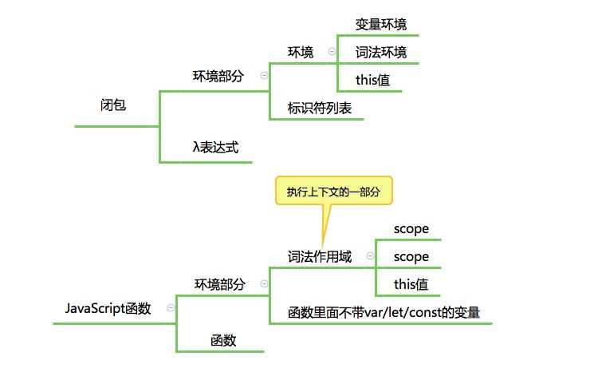
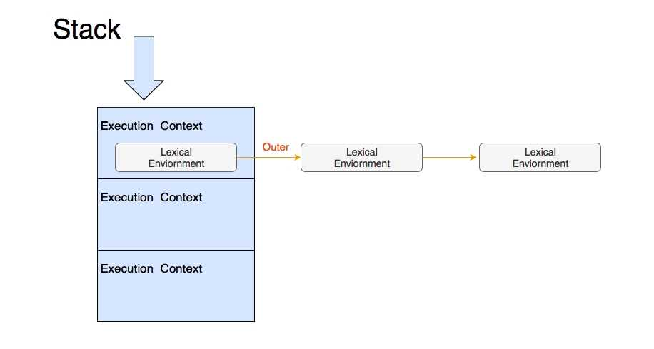
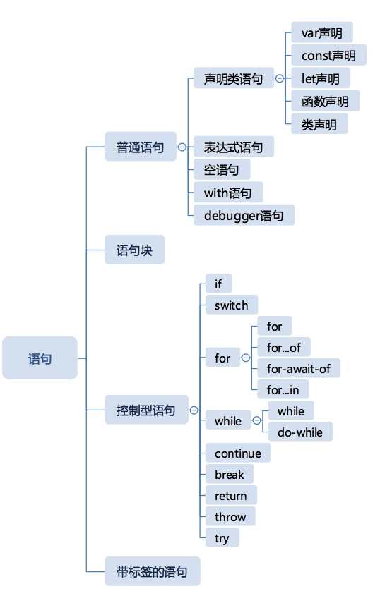
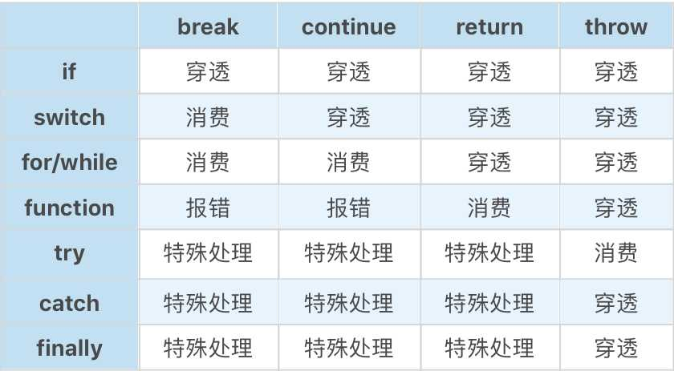

# JavaScript 运行

## 一、JS执行-任务

### 宏观任务 & 微观任务

* 当拿到一段JavaScript代码，浏览器或Node传递给JavaSc引擎，并要求他去执行
* 一个JavaScript引擎会常驻于内存中，等待我们（宿主）把JavaScript代码或函数传递给它执行
* ES3之前，JavaScript本身还没有异步执行代码的能力：宿主给引擎一段代码，顺次执行（宿主发起任务）
* ES5之后，JavaScript引入Promise，不需要浏览器安排，JS引擎本身也可以发起任务

> JSC引擎的术语：宿主发起的任务成为 __宏观任务__，JavaScript引擎发起的任务称为 __微观任务__
  * JS引擎等待宿主环境分配宏观任务，在操作系统中，通常等待的行为都是一个事件循环，所以在Node中，也把这个部分称为事件循环
  * 在底层C/C++代码中，这个时间循环是一个跑在独立线程中的循环，伪代码：(宏观任务)
    ```
    while(TRUE) {
      r = wait();
      execute(r);
    }
    ```
  * 宏观任务中，JS的Promise还会产生异步代码，__JS必须保证这些异步代码在一个宏观任务中完成__，因此，__每个宏观任务又包含了一个微观任务队列__(Promise产生的微观任务就在这个队列中)
  * 以此实现JS引擎级和宿主级任务
    * __Promis永远在队列尾部添加微观任务；setTimeout等宿主API，会添加微观任务__
    * 这里疑问？为什么setTimeout等级是JS引擎级别的，猜测说法：是浏览器提供给JS引擎的的API
 

### JS异步执行-Promise与setTimeout 执行顺序

JS异步执行-Promise
* JavaScript语言提供的一种标准化异步管理方式
* IO、等待或其他异步操作 返回一个“承诺” 函数调用方可在合适的实际，选择等待这个承诺兑现（.then）
* 注意：resolve始终是异步操作，即then的回调，应该永远在当前代码块之后执行，即使Promise中立即兑现了承诺
  ```js
    var r = new Promise(function(resolve, reject){
      console.log('a');
      resolve();
    });
    r.then(()=>{
      console.log('c');
    });
    console.log('b');
  ```

JS异步执行-Promise与setTimeout
* __Promise是JavaScript引擎产生的内部微观任务； setTimeout是浏览区API，产生的是宏观任务__
  ```js
    //无论代码顺序如何，d必定在c之后
    setTimeout(()=>{
      console.log('d');
    }, 0);

    var r = new Promise(function(resolve, reject){
      console.log('a');
      resolve();
    });
    r.then(()=>{
      var begin = Date.now();
      while(Date.now() - begin < 1000); //耗时任务，确保c2在d之后被添加到任务队列
      console.log('c1');
      new Promise(function(resolve, reject){
        resolve();
      }).then(()=>{
        console.log('c2');
      })
      console.log('c');
    });
    console.log('b');
  ```
  * 永远记住一个原则： Promise是JS引擎产生的当前宏观任务中的微观任务，setTimeout是浏览器API产生的宏观任务，永远会在当前宏观任务之后执行
  * 永远记住另一个原则：JS本身是单线程，所有任务按队列顺序执行，哪怕里面有耗时任务（耗时任务!=异步任务）
  ``` js
    //练习题：1
    var t1 = function(){
    setTimeout(()=>{
          console.log('d');
        }, 0);

        var r = new Promise(function(resolve, reject){
          console.log('a');
          resolve();
        });
        r.then(()=>{
          var begin = Date.now();
          while(Date.now() - begin < 1000); //耗时任务，确保c2在d之后被添加到任务队列
          console.log('c1');
          new Promise(function(resolve, reject){
            resolve();
          }).then(()=>{
            console.log('c2');
          })
          console.log('c');
        });
        console.log('b');
    };
    var t2 = function(){
      console.log('t2');
      setTimeout(()=>{
          console.log('d2');
        }, 0);
    var r = new Promise(function(resolve, reject){
          console.log('a2');
          resolve();
        });
        r.then(()=>{
          console.log('c22');
        });
      console.log('b2');
    }
    t2();t1();  //t1();t2()呢;
  ```
* 理解：宏观任务虽然是浏览器API产生的，但是它与JS线程并不是并行的，它只是一个单独的任务管理中心，JS还是单线程执行，意思就是setTimeout的duration可能不准确吗？应该是duration之后将任务放入JS的执行队列，但是如果js线程此时并不空闲，那么正在执行的队列会被打断吗？还是setTimeout的任务队列会等待呢？  __不会被打断，setTimeout产生的宏观任务与其他宏观任务并无差别，都会按规矩执行；这里要清晰的把握一个原则：JS永远单线程执行！！！这里讨论的是运行时，运行时规则不会变（队列，不存在打断），只要放到运行时队列中的任务都是线性执行的。按这样理解的话，所谓的各种驱动，就是把任务放到执行队列（所谓的打断，操作无响应的来源）；放入队列的时机（duration与js提供的异步方法）与放入的任务类型（宏观、微观）是执行先后的两大决定因素__ 所以js（浏览器端）是做不到精确的按时（轮循）执行的吗？（除非只有一个任务？因为任何事件相应都会打乱队列）

理解 async/await
* 他的运行时基础是Promise
* async函数必定返回Promise，我们把所有返回Promise的函数都可以认为是异步函数
```js
  //练习： 理解await
  function sleep(duration) {
    return new Promise(function(resolve, reject){
      setTimeout(resolve, duration);
    });
  }
  async function foo (){
    console.log('a');
    await sleep(5000);
    console.log('c');
  }
  foo().then(()=>{console.log('d');});
  console.log('b');
```


-----


## 二、JS函数执行过程


#### 执行上下文
执行上下文（JS标准）：一段代码（包括函数），执行所需的所有信息

 ES2018中，执行上下文包括：
  * lexical environment：词法环境，获取变量或this值时使用
  * variable environment：环境变量，声明变量时使用
  * code evaluation state：用于恢复代码执行位置
  * Function：执行的任务是函数时使用，表示正在被执行的函数
  * ScriptOrModule：执行的任务是脚本或模块时使用，表示正在被执行的代码
  * Realm：使用的基础库和内置对象实例
  * Generator：仅生成器上下文有这个属性，表示当前生成器

* var声明与赋值
  * var是函数执行的作用域（会穿透for、if等）
  * 通过立即执行函数表达式（IIFE）构造函数的执行环境
  * width的语法
  * let
    * ES6开始引入
    * 为了引入let，JS在运行时引入了块级作用域（在let出现之前，JS的if for等皆不产生作用域）
* Realm【国度、领域、范围】 （9.0引入）
  * Realm中包含一组完整的内置对象，且是复制关系

* interesting：“具有名称的函数表达式”会在外层词法环境和它自己执行产生的词法环境之间产生一个词法环境，再把自己的名称和值当作变量塞进去
```js
  var b = 10;
  (function b(){
    b=20;
    console.log(b); //fn  （试图改变一个只读变量b）
  })();
```

#### 函数
* 普通函数： function关键字定义的函数
* 箭头函数： 用 => 运算符定义的函数
* 在class中定义的函数： 
  ```js
  class C {
    foo(){
    }
  }
  ```
* 生成器函数： 用 function * 定义的函数
  ```js
  function* foo(){
  }
  ```
* 类： 用class定义的类，其实也是函数
* 异步函数
  * 普通函数加async
  * 箭头函数加async
  * 生成器函数加async

#### this关键字
* 函数调用时，获取函数的表达式，实际是一个 [Reference类型](js/type.md)
  * Reference类型由两部分组成： 一个对象（this指向）和一个属性值（方法）
  * Reference会被解引用：算术运算或其他运算
* 箭头函数无论用什么引用调用，都不影响this值
* 注意方法的行为

this 关键字的机制：
  * [[Environment]]私有属性： 函数用来保存 __定义时__ 上下文的属性
  * 切换上下文：当一个函数执行时，会创建一条新的执行环境记录，记录的外层词法环境（outer lexical environment）会被设置成函数的[[Environment]]，JS用一个栈管理执行上下文，栈中的每一项包含一个链表： 
  * [[thisModel]]私有属性：
    * 有三个取值：
      * lexical（词汇的）：表示从上下文中找this，这对应了箭头函数
      * global： 表示当this为undefined时，取全局对象，对应了普通函数
      * strict： 当严格模式时使用，this严格按照调用时传入的值，可能为null或者undefined
    * 注：方法的行为和普通函数有差异，因为class设计成了默认按strict模式执行
      ```js
      //普通情况
      function showThis(){
        console.log(this);
      }
      var o = {
        showThis: showThis
      }
      showThis(); //global
      o.showThis(); //o

      //箭头函数
      const showThis = () => {
        console.log(this);
      }
      var o = {
        showThis: showThis
      }
      showThis(); //global
      o.showThis(); //global

      //方法
      class C {
        showThis(){
          console.log(this);
        }
      }
      var o = new C();
      var showThis = o.showThis;
      showThis(); //undefined
      o.showThis(); //o

      //use strict
      "use strict"
      function showThis(){
        console.log(this);
      }
      var o = {
        showThis: showThis
      }
      showThis(); //undefined
      o.showThis(); //o
      ```
  * 函数创建新的执行上下文中的词法环境记录时，会根据[[thisModul]]来标记新纪录的[[ThisBindingStatus]]私有属性
    * 代码执行遇到this时，会祝逐层检查当前词法环境记录中的[[ThisBindingStatus]]，当找到有this的环境记录时获取this的值
      * 箭头函数中的代码都指向外层this

JavaScript提供的操作this的内置方法：
 * Function.prototype.call和Function.prototype.apply: 指定函数调用时传入的this值；这两者是一样的，只是传参方式有却别
 * Function.prototype.bind：生成一个绑定过的函数
 * call、apply、bind用于不接受this的函数类型（箭头函数、class）都不会报错，但无法改变this，但可以实现传参

通过new调用函数：只有普通函数和类能够跟new搭配使用


---


## 三、JS执行 - 语句

> 因为JS语句存在嵌套，所以执行过程实际上主要在一个树形结构上进行，其中每一个节点执行后产生Completion Record，根据语句结构和Completion Record，JS实现了各种分支和跳出逻辑

Completion 类型：JavaScript语句执行机制涉及的一种基础类型
  ```js
  // 真的是finally里面的return “覆盖”了try里面的return？（try里面的return确实执行了？）
  var ttt = 1;
  function foo(){
    try{
      // return (ttt = 2);  //
      return 'return try';
    } catch(err){
    } finally {
      console.log('finally');
      // return 'return finally';   //finally return finally
    }
  }
  console.log(foo()); // finally return try
  console.log(ttt); //2
  ```
Completion Record：描述异常、跳出等语句执行过程，表示一个语句执行完之后的结果，有三个字段：
  * [[type]] 表示完成的类型，有break continue return throw 和 normal 几种类型
  * [[value]] 表示语句的返回值，如果语句没有，则是empty
  * [[target]] 表示语句的目标，通常是一个JavaScript标签

  语句的分类：

  

  * 普通语句： 不带控制能力的语句
    * 从前到后一次执行（先忽略var和函数声明的预处理机制），没有任何分支或重复执行逻辑
    * Completion Record：
      * [[type]]-normal，JS遇到这样的Completion Record会继续执行下一条语句
      * 只有表达式语句会产生[[value]] （对于引擎控制，没有啥用处） __【Chrome控制台显示的正是语句的Completion Record的[[value]]】__
  * 语句块（block）：大括号括起来的一组语句，是一种语句的复合结构，可以嵌套
    * Completion Record：
      * 语句块内部的语句的[[type]]如果不为normal，会打断语句块后续的语句执行
      * 如果在block中插入一条return语句，产生了一个非normal记录，那么整个block会成为非弄normal（保证了非normal的完成类型可以穿透复杂的语句嵌套结构，产生控制效果）
      ```js
      {
        var i = 1;  //normal, empty, empty
        return i; //return, 1, enpty
        console.log(i++);
      } //return, 1, enpty
      ```
  * 控制型语句：
    * 分两部分
      * 对其内部造成影响：if、switch、while/for、try
      * 对外部总成影响：break、continue、return、throw
    * 控制语句跟break、continue、return、throw四种类型组合产生的效果：
      
    * 上面的try/return的case中：finally中的内容必须保证执行，所以try/catch执行完毕，即使得到的结果是非normal行的完成记录，也必须要执行finally（try中的return执行了！！！）；然后当finally执行也得到了非normal记录，则会使finally中的记录作为整个try结构的结果
  * 带标签的语句
    * 任何JavaScript语句都可以加标签：在语句前面加冒号即可
      * ``` hahahahha: var tt = 1; ```
    * 作用：大部分时候没有任何用处，类似于注释；唯一有作用时：与完成记录类型中的target配合，用于跳出多层循环
    * __break/continue语句如果后跟了关键字，会产生带target的完成记录。一旦完成记录待了target，那么只有拥有对应label的循环语句会消费它__
      ```js
      var i=0, j=0;
      outer: while(i++<7) {
        inner: while(j++<105){
          break outer;
        }
      }
      console.log('finished');
      console.log('i: ' + i);
      console.log('j: ' + j);
      ```

    

