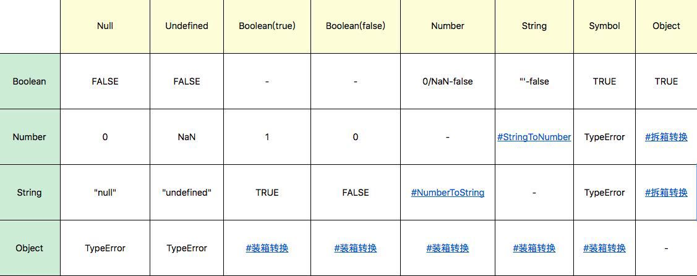
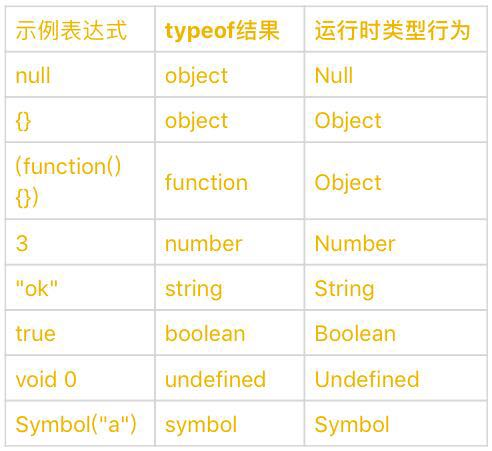

# 类型 （运行时）

## 基础
JavaScript语言的每一个值都属于某一种数据类型。JavaScript规定了7中语言类型：
1. Undefined
2. Null
3. Boolean
4. String
5. Number
6. Symbol
7. Object

### Undefined Null
* Undefined类型表示未定义，只有一个值 - undefined。 MDN:

  _undefined is a property of the global object; i.e., it is a variable in global scope. The initial value of undefined is the primitive value undefined._

  _In modern browsers (JavaScript 1.8.5 / Firefox 4+), undefined is a non-configurable, non-writable property per the ECMAScript 5 specification. Even when this is not the case, avoid overriding it._

* Null类型也只有一个值 - null，其语义表示“空值”。

  null是JavaScript关键字。

* null表示“定义了但是为空”。在实际编程时，一般不会把变量赋值为undefined，可以保证所有值为undefined的变量，都是未赋值的自然状态。

#### 0 "" false null undefined
typeof:
1. false -> boolean
2. 0 -> number
3. "" -> string
4. null -> object
5. undefined -> undefined

关于判断：
* false类： 0 "" false
* 其他： null undefined

### String  
* 最大长度： 2^53 - 1 （受字符串的编码长度影响）
* String的意义并非“字符串”，而是字符串的UTF16编码（charAt、charCodeAt、length等方法都是UTF16编码）
* JavaScript的字符串是永远无法变更的。具有值类型的特征
* 处理BMP（超出U+0000 - U+FFFF范围）的字符时，格外小心；此设计继承自Java

### Number
* 基本符合IEEE 754-2008规定的双精度浮点数规则
* 例外情况：
  * NaN，占用 9007199254740990，原本是符合IEEE规则的数字
  * Infinity， 无穷大
  * -Infinity， 无穷小
* JavaScript有 +0 和 -0，注意除法中的区分（检测： 1/x ，判断时Infinity还是-Infinity）
* 注意非整数Number类型精度问题。用JavaScript提供的最小精度值： ```Math.abs(0.1 + 0.2 - 0.3) <= Number.EPSILON```

### Symbol 
* ES6引入的新类型：一切非字符串对象key的集合。（ES6规范中，整个对象系统被用Symbol重塑）
* Symbol可以具有字符串类型的描述，但即使描述想吐，Symbol也不相等
* 创建： 使用全局的Symbol函数： ```var mySymbol = Symbol('my symbol);```
* 一些标准中提到的Symbol，可以在全局的Symbol函数属性中找到。 用Symbol.iterator来定义for...of在对象上的行为：
  ```
  var o = new Object;
  o[Symbol.iterator] = function(){
    var v = 0;
    return {
      next: function() {
        return {value: v++, done: v > 10}
      }
    }
  };

  for (var v of o){
    console.log(v); //0 1 2 3 ... 9
  }
  ```

### Object
* 在JavaScript中，对象的定义是“属性的集合”。 属性分为数据属性和访问器属性，二者都是key-value结构，key可以是字符串或Symbol类型
* 类： JavaSc中的“类”仅仅是运行时对象的一个私有属性，JavaScript是无法自定义类型的！ （C++和Java中每一个类都是一个类型，二者几乎等同）
* JavaScript中几个基本类型都有对应的对象类型：Number，String，Boolean，Symbol
* Number，String，Boolean三个构造器是两用的，跟new搭配，产生对象；直接调用，强制类型转换
* Symbol函数比较特殊，用new调用会跑出错误，但它仍然是Symbol对象的构造器
* JavaScript语言设计上试图模糊对象和基本类型之间的关系，我们日常代码可以把对象的防范在基本类型上使用： ```'hahahah'.charAt(2)```
* 为什么给对象添加的方法能用在基本类型上？运算符提供了装箱操作，他会 __据基础类型构造一个临时对象__，使得我们能在基础类型上调用对象的方法。

## 类型转换
* 臭名昭著的“==”，据说属于设计失误，试图实现跨类型的比较，规则复杂到几乎没人可以记住；没有深入学习价值
* 转换规则：

### StringToNumber
* Number(x)：支持十进制、二进制、八进制、十六进制；支持正负；支持科学计数法（'1e3'）
* parseInt使用时，建议传入第二个参数；不传只支持16进制前缀“0x"，并且忽略非数字字符串，且不支持科学计数法
* parseFloat直接把原字符串作为十进制解析，不支持其他进制

### NumberToString
* 当Number较大或较小时，使用科学计数法表示（保证产生的字符串不会过长）

### 装箱转换 - 把基本类型转换为对应的对象
* 利用一个函数的call方法强迫产生装箱 (装箱机制会产生临时对象，性能要求高的场景应避免使用)
```js
var symbolObject = (function(){return this;}).call(Symbol('a'));
console.log(typeof symbolObject); //object
console.log(symbolObject instanceof Symbol); //true
console.log(symbolObject.constructor == Symbol); //true
```
* 每一类装箱对象皆有私有的Class属性，这些属性可以用Object.prototype.toString获取 (JS中没有任何方法可以更改私有的Class属性，Object.prototype.toString可以准确识别对象对应的基本类型，比instanceof更准确)
```js
var symbolObject = Object(Symbol('a'));
console.log(Object.prototype.toString.call(symbolObject)) //[object Symbol]
```
* call本身会产生装箱操作，需要配合typeof区分基本类型还是Object

### 拆箱转换 - ToPrimitive
* 拆箱转换会尝试调用valueOf和toString来获取拆箱后和基本类型，如果二者都不存在，或没有返回基本类型，则会产生错误TypeError
```js
var o = {
  valueOf: () => {console.log('valueOf'); return {}},
  toString: () => {console.log('toString'); return {}},
}
o * 2;  // valueOf toString TypeError
o + ""; // toString valueOf TypeError       （到Sting的拆箱会优先调用toString）
```
* ES6之后，允许对象通过显式指定 ```@@toPrimitive Symbol``` 来覆盖原有的行为
```js
var o = {
  valueOf: () => {console.log('valueOf'); return {}},
  toString: () => {console.log('toString'); return {}},
}
o[Symbol.toPrimitive] = () => {console.log('toPrimitive'); return 'hello'}
console.log(o + "");  // toPrimitive hello
```

## 其他类型
* List 和 Record： 描述函数传参过程
* Set: 解释字符串集等
* Completion Record：描述异常、跳出等语句执行过程
* Reference： 描述对象访问属性、delete等
* Property Descriptor：描述对象的属性
* Lexical Environment 和Environment Record：描述变量和作用域
* Data Block: 描述二进制数据


## More... (typeof 与 JS的运行时类型)
"类型"在JavaScript中是一个有争议的概念。

一方面，标准中规定了运行时数据类型；另一方面，JS语言中提供了typeof这样的运算，用来返回操作数的类型，但typeof的运算结果，与运行时类型的规定有很多不一致的地方。对照表：


从一般语言使用者的角度看，我们应该按照typeof的结果去理解语言的类型系统。但JS之父本人也表示，typeof的设计是有缺陷的，只是现在已经错过了修正它的时机 