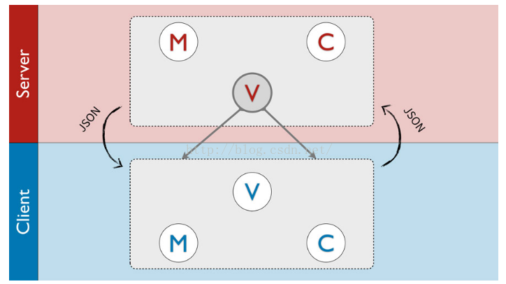

# MIS-前端改造解决方案

解决问题：
> 前端重复 接口校对时间成本   【前端封装度不够；封装组件使用不规范；前后端接口不规范，大量冗余数据，接口数据结构不够简洁清晰】

> 后端多语言                【去除前后端的耦合（现有的后台MVC），或者后端搭桥】

### 解决方案
原则：
> 目前的MIS保留、不重构， 但是进行完善；新的模块之类的使用新的方案

#### 两部分方案： 
##### 一. 原有框架部分：（前端维护前端）

###### （一）. 前端页面模块封装加强，讲配置暴露给后端，页面配置由后端传，但是该对的字段是无法避免的，尽量不要让规则太曲折，见词知意，后端传的数据需要精简

1. 不能由后端自己写模板：涉及到样式和事件绑定可能会不好处理，反而增加了前后端耦合性，中间调试更费时间

2. 这样前端需要扩展的东西就很少了（部分新页面直接不需要前端，大大减少了前后端对字段的量）

详细说明：前端取约定好的配置，有该配置则根据配置渲染该页面块

组件 | 配置部分 | 备注 
  - | :-: | :-: 
  面包屑 | Array，name、actived、url | 展示、跳转 
  表格 | 数据API/数据源、表头、数据对应字段、分页配置 |  操作列由前端配置
  quickNav | 参照原来的页面 | 与表格绑定的组件
  search | 参照原来的页面 | 与表格绑定的组件
  详情数据 | 详情字段（editable字段）、图片列表 | 用于view页面，用于展示及编辑；前端回传根据详情字段
  编辑数据 | 详情字段（editable字段）、图片列表、保存接口 | 前端回传根据详情字段
  config | 页面的配置数据 | select、单元格内数据渲染、详情或编辑数据源及渲染
  操作btn-group | 参照原来的页面 | 前端自用
###### （二）. 提取公用页面 节省20%成本
    
  对于某些简单的展示型页面，后端直接根据接口规则调用同一个模板，不需要前端任何介入；
    
  只需在左侧菜单添加对应的新页面路径（一行代码）

详细页面：

页面 | 公用部分 | 备注 
  - | :-: | :-: 
  list页面 | quickNav、条件搜索、翻页、跳转/导出功能按钮、操作列简单的操作（查看、删除）|  
  view页面 | 新窗口、标题、详情字段、右侧图片、功能btn【编辑】| 仅供展示 
  edit页面 | （不）可编辑字段、功能btn【保存、取消】 | 简单编辑

##### 二. 针对新的框架，后台多语言：（后端维护前端）
1. 继续使用模板，有的语言可能不支持，针对不同语言，这个是后端需要去探索的，但是前端还可能要根据不同的模板语法重新封装；不可行
2. 做前后端分离，页面全部交给前端，不用模板渲染，后端不考虑视图和controller
3. 前端代码全部交由后端维护（后端全票通过）

  详细如现在的VRM或BCS系统，让服务器配置跳转，新系统页面请求不过后端controller；分离后，前端使用webpack+vue+element的框架（npm做包管理），两边保留所有左侧菜单导航

###### 前后端分离
1. 新旧页面样式差异；
2. 约定目录，服务器转发
3. 详细实现云川以前做过类似的系统

##### 说明、后期TODO
1. 本方案通过后，完善改进后，出排期表
2. 本方案通过后，解决方案部分编写wiki文档（主要是原MIS部分）
2. 本方案通过后，后端人员需要学习简单前端技术，主要是element文档调用；前端做支持

------

###### 其他问题： 
1. 后端多语言，我一直不理解关前端什么事情，又关系统框架什么事情；一个系统诞生，前后端开发框架肯定是明确好的，那么前端不可能是一个前端系统还要去调多个后端系统的，都是部署在一个系统里面的，前端为什么要关心后台多语言？
2. 现在的MIS就是典型的后端MVC分离式架构，模板引擎是后端MVC的一个实现，盗图：

3. 后端MVC关于页面渲染：页面加载肯定会快一些，并且减少了http请求；但是局部渲染还是要靠接口，靠前端；所以MIS这边很多操作都是简单粗暴的reload整个页面
4. arttemplate与react.js、vue.js等是一个层级的东西，这两者才有可比性(现在MIS使用的前端模板引擎这三者都用了)；smarty与react、vue的整体解决方案才是一个维度的东西(实际是php和NodeJs的对比)

__引用及参考资源__: 

[后端MVC V.S. 前端MVVM](https://www.cnblogs.com/itfantasy/p/6016033.html) 

[前端与后端MVC、MVVM等设计模式区别与联系](https://blog.csdn.net/xcymorningsun/article/details/53218630) 

[前端模板引擎与后端模板引擎](https://www.jianshu.com/p/953c08602112) 

[浅谈 Web 中前后端模板引擎的使用](https://www.cnblogs.com/Renyi-Fan/p/9004047.html) 

[vue.js有什么用，是用来做什么的](https://www.cnblogs.com/Renyi-Fan/p/9419742.html) 
