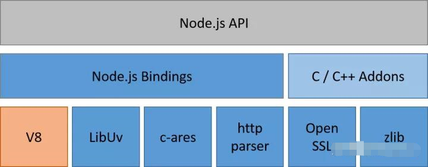
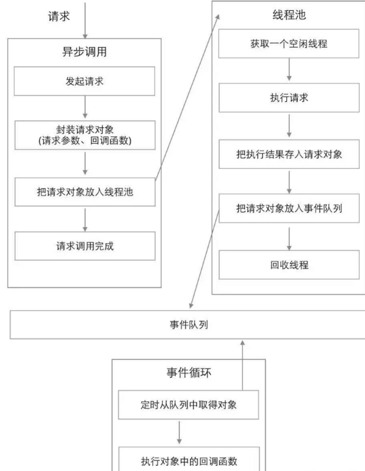
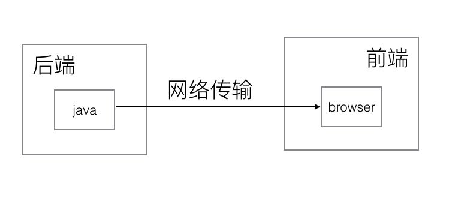
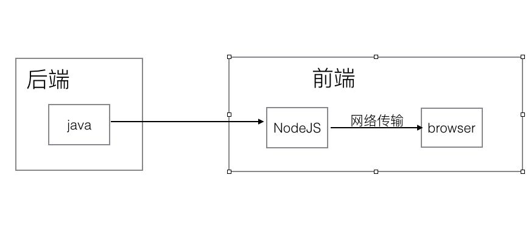
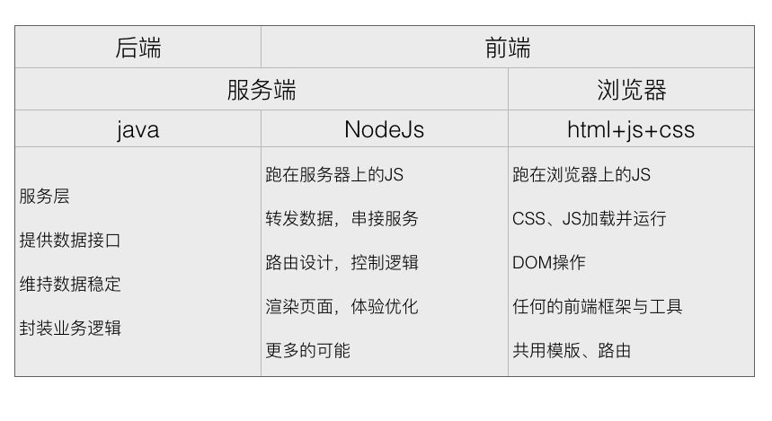
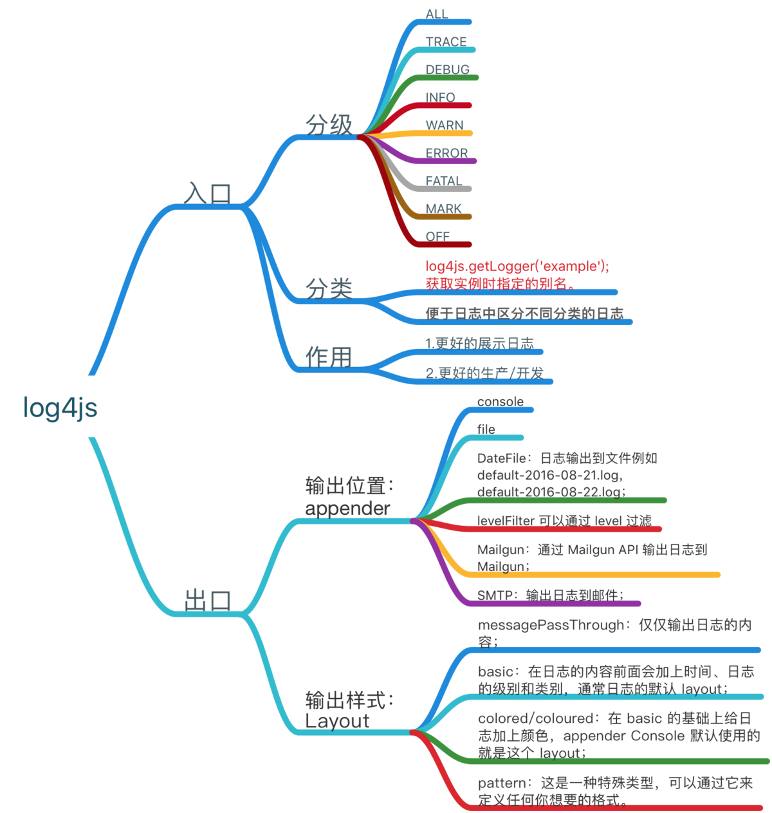

# node中后台方案

## 一、概念知识

### 1. 理解Node.js
1. 简单的说Node.js 就是运行在服务端的 JavaScript
2. Node.js 是一个基于Chrome JavaScript 运行时建立的一个平台
3. Node.js是一个事件驱动I/O服务端JavaScript环境，基于Google的V8引擎，V8引擎执行Javascript的速度非常快，性能非常好
4. 结构组成：

### 2. 执行机制：TODO:参考从原理上理解NodeJS的适用场景；有时间再去看看进程和线程
NodeJS是异步单线程的

在Node.js中，绝大部分API都是异步的，有一个很形象的故事描述了JAVA和Node.js的区别，JAVA是一个餐厅100个服务员对应100客户，Node.js是一个服务员玩命干，也对应100个客户，上菜的速度很大一部分取决于厨师的做菜速度

* 关于nodeJS单线程的理解：
Node.js的单线程并不是真正的单线程，只是开启了单个线程进行业务处理（cpu的运算），同时开启了其他线程专门处理I/O。当一个指令到达主线程，主线程发现有I/O之后，直接把这个事件传给I/O线程，不会等待I/O结束后，再去处理下面的业务，而是拿到一个状态后立即往下走，这就是“单线程”、“异步I/O”。
  * nodeJS的事件主要是网络请求、文件I/O等
  * 什么是I/O操作：
    >IO在计算机中指Input/Output，也就是输入和输出。由于程序和运行时数据是在内存中驻留，由CPU这个超快的计算核心来执行，涉及到数据交换的地方，通常是磁盘、网络等，就需要IO接口。(廖雪峰)
  * 语言对比-处理请求
    * Java/PHP如和处理：每个连接都会生成一个新线程，每个新线程可能需要2MB的配套内存（eg：在一个拥有8GBRAM的系统上，理论上最大的并发连接数量是4,000个用户）；因此用户量增长，只有扩容。【所以在传统的后台开发中，整个Web应用程序架构（包括流量、处理器速度和内存速度）中的瓶颈是：服务器能够处理的并发连接的最大数量。这个不同的架构承载的并发数量是不一致的。】
    * Node：更改连接到服务器的方式。Node 声称它不允许使用锁，它不会直接阻塞 I/O 调用。Node在每个连接发射一个在 Node 引擎的进程中运行的事件，而不是为每个连接生成一个新的 OS 线程（并为其分配一些配套内存）。
      * 但是，非IO、网络通信等耗时比较长的操作，nodejs就主线程自己处理，自己本身又是单线程，对CPU要求比较高的CPU密集型任务多的话，就有可能会造成号称高性能，适合高并发的node.js服务器反应缓慢。

### 3. 优势
1. 前端学习成本低，由前端人员开发，为页面服务，更贴近交互端，是前端人员应该关注的
2. 事件驱动、非阻塞 I/O，适合高并发、 IO 密集型业务（高并发 为网站访问而生）

### 4. 缺点
* 计算密集型业务处理

### 5. 应用场景：非密集型计算型
1. 合并接口：后台多系统服务，减少HTTP请求数
2. 二次处理接口数据
3. 解决跨域：本地开发 跨域请求
4. 服务端模板，服务端渲染：性能、SEO
5. 响应格式的数据：适应不同屏幕 【聚合、裁剪、适配】
6. Bigpiper

* 传统开发分工【依照硬体环境划分】（盗图淘宝）： 

* node出现后分工【依照业务职责划分】（盗图淘宝）： 

* node出现后各司其责（盗图淘宝）： 

### 6. 生态圈
1. webpack
2. express, koa, koa2, egg等框架，结合Restful架构
3. GraphQL
4. mongodb：非关系行数据库，轻量级，配合node使用较多
5. sqlite：自给自足的、无服务器的、零配置的、事务性的 SQL 数据库引擎
6. Electron：可以使用Node.js的API，V8的环境也被打包在内【Node.js在做接入层，比如Electron中，可以调用很多Node API，完成渲染进程不能做的事情，例如文件io,buffer操作等】
7. C++插件：V8环境就是C++写的，自然也是可以使用C++插件
8. Redis
9. SSR
10. websocket
11. puppeteer爬虫

6. 解决问题：
  * 后端不想单独给前端提供整合数据的接口
  * OMS只想专人做专事，不想提供外网服务
  * 后端一个系统可能给多个客户端提供数据，各种跨域麻烦
  * 唉，听说前端可以自己整后台服务。。。

## 二、框架选择（主要见参考文档，写的很细）
1. sail.js ::: 基于express 免费 官方提供收费维护  不推荐：：：文档太少 只有官网（英文）
2. Hapi.js ::: 和Express同一层级的框架（Express更老，更成熟）
3. Express.js ::: 
  >Express是一个简洁而灵活的node.js web框架，提供了一系列强大特性帮助你创建各种web应用，和丰富的HTTP工具。使用Express可以快速地搭建一个完整功能的网站。
4. Mean.js ::: MEAN = MongoDB + Express + AngularJS + NodeJS，它是基于 JavaScript 的现代 Web 应用全栈开发工具。 
5.  Koa.js ::: Koa是下一代的Node.js的Web框架。由Express团队设计。旨在提供一个更小型、更富有表现力、更可靠的Web应用和API的开发基础。【中间件都是第三方插件】

## 三、搭建流程

### 1. 体验Express ：：：强大的 基础的 灵活的 web框架
* Express安装及Hello World体验：[Node.js Express框架 | 菜鸟](http://www.360doc.com/content/18/0422/07/32517277_747703104.shtml) [nodejs+express](https://www.cnblogs.com/wgl0126/p/9290157.html)
  * request及response
  * 路由
  * 静态文件
* 推荐一个热部署加载node工具–supervisor [如何使用](https://www.cnblogs.com/Leo_wl/p/3800276.html)

## 四、部署
简单讲就是把我们本地 node app.js起的服务在服务器上面起；
重点是如何管理这个服务，是否需要考虑性能监控、自动重启、负载均衡

* 方案：（具体的看寿海可以详细讲讲PM2）
  1. 配置 Nginx 实现反向代理
  2. PM2 管理node服务
    * 内建负载均衡（使用 Node cluster 集群模块）
    * 后台运行
    * 0 秒停机重载，我理解大概意思是维护升级的时候不需要停机.
    * 具有 Ubuntu 和 CentOS 的启动脚本
    * 停止不稳定的进程（避免无限循环）
    * 控制台检测
    * 提供 HTTP API
    * 远程控制和实时的接口 API ( Nodejs 模块，允许和 PM2 进程管理器交互 )

### pm2
pm2是一个自带负载均衡功能的node应用的进程管理器。

## 五、开发

### 0. 项目目前功能及接口约定，先看一下
  [接口文档](https://shimo.im/folder/8dVQdkXPVcHH93wR)

### 1. 移步
  [node.js-server项目README](https://gitee.com/lsh_front_end/node.js-server/tree/saas-dev/)

### 2. node.js-server项目的中间件、异常处理及Log，见FeSaasService.xmind
  * log4js文档参考[Nodejs log4js日志管理详解](https://www.jianshu.com/p/9604d08db899)
  

### 3. express Routes
#### 路由
http://dev.market-mis.dev01.saasdev.dmallmax.com/order/user/list
* 默认80端口，浏览器会自动转换
* 协议 服务器主机地址（PC做DNS转换为IP） path
* path【/order/user/list】即为路由的路径，真正到达服务器的资源定位符，具体服务内部根据这个定位服判断给出什么响应

#### express Routes
> Routing refers to how an application’s endpoints (URIs) respond to client requests.
> You define routing using methods of the Express app object that correspond to HTTP methods; for example, app.get() to handle GET requests and app.post to handle POST requests.
> You can also use app.all() to handle all HTTP methods and app.use() to specify middleware as the callback function
Express 是一个自身功能极简，完全是由路由和中间件构成一个的 web 开发框架：从本质上来说，一个 Express 应用就是在调用各种中间件。

中间件（Middleware） 是一个函数，它可以访问请求对象（request object (req)）, 响应对象（response object (res)）, 和next 的变量。

路由get、post这些东西，就是中间件，中间件讲究顺序，匹配上第一个之后，就不会往后匹配了。next函数才能够继续往后匹配。

* app.use()
  * 非精确匹配
* app.get()
  * 精确匹配
* app.post()
  * 精确匹配

Nodejs express 框架之 路由与中间件: https://www.rokub.com/7066.html
Express路由和中间件: https://www.cnblogs.com/xuxiaozhi/p/7976107.html

https://tech.meituan.com/2018/09/06/fe-tiny-spa.html

### 4. 关于Koa
TODO: 下次分享【源码解读，就四个文件】

### 5. 关于JS
TODO: 下次分享【JS规范、JS运行、浏览器端JS与NODEJS、主要模块等等，分几个专题】
1. promise await 本身就是异步的，第二个请求进来会马上创建child process 【这一说法是真的？那就很秀了】
2. module
3. HTTP

## 六、项目总结
### 项目开发曲线
TODO:
## 七、问答讨论

---
# 参考文章：
* Node.js运行原理、高并发性能测试对比及生态圈汇总： https://segmentfault.com/a/1190000019425388?utm_source=tag-newest
* 关于nodejs作为系统中间件的理解： https://blog.csdn.net/qq_27965129/article/details/78766313
* 浅谈前后端分离与实践 之 nodejs 中间层服务：https://zhuanlan.zhihu.com/p/30384677
* node.js之十大Web框架： https://www.cnblogs.com/youcong/p/10503099.html
* 从原理上理解NodeJS的适用场景： https://www.cnblogs.com/kevin9103/p/5053517.html
* Nodejs项目服务器部署： https://blog.csdn.net/u014465934/article/details/83663407
* node项目架构与优化： https://www.cnblogs.com/139199228-haicao/p/9193753.html