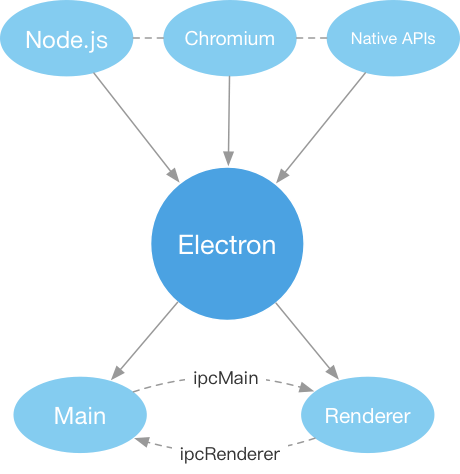

# Electron 从 0 开始

## WHAT
  * 桌面应用
    * 原生开发：直接将语言编译成可执行文件，直接调用系统API，完成UI绘制等。这类开发技术，有着较高的运行效率，但一般来说，开发速度较慢，技术要求较高【使用C++ / MFC开发Windows应用，Objective-C开发MAC应用】
    * 托管平台：编译成中间文件，通过平台或虚拟机完成二次加载编译或解释运行【C# / .NET Framework(只能开发Windows应用)；Java】
    * WEB开发： 使用WEB技术进行开发，利用浏览器引擎完成UI渲染，利用Node.js实现服务器端JS编程并可以调用系统API【WEB的强大生态为UI带来了无限可能，并且开发、维护成本相对较低】
  * Electron： 由Github开发，用HTML，CSS和JavaScript来构建跨平台桌面应用程序的一个开源库；通过将Chromium和Node.js合并到同一个运行时环境中，并将其打包为Mac，Windows和Linux系统下的应用

  * 优点：【浏览器沙盒/用户体验】
    * 强大生态的Web技术 -> 开发成本低，可扩展性强，UI
    * 跨平台，一套代码可打包为Windows、Linux、Mac三套软件【事实证明开发的时候，针对不同系统还是要有部分差异】
    * 直接在现有Web应用上进行扩展，提供浏览器不具备的能力
    * 不用再考虑兼容性问题【跟传统web相比】
    * 直接操作系统API 【Node.js、几十万个npm模块】
    * 跨域

  * 市场：VS Code客户端、GitHub客户端、Atom客户端、迅雷。。。。。。

### 对比
* 原生：（C#/C+）+稀缺、成本高，不能跨操作系统
* QT：
* NW.js：
* Swing：
* [easy-window](https://github.com/lixk/easy-window)：使用简洁，体积小；扩展少、文档少
* [webview](https://github.com/zserge/webview)：打包后文件很小。通常是几百KB左右。开发起来不太方便([看起来就很麻烦](https://yq.aliyun.com/articles/594311))。适合做小工具

* weex：
* RN：

### 结构
  

### 具备知识
* 前端基础：html、css、js及相关工程化技术
* node基础：what、how、Do；npm；Express/Koa了解一下
* 对原生开发有一定理解

#### 运行时
两种进程：
  * 主进程：main脚本的进程
  * 渲染进程：每个 Electron 中的 web 页面运行在它自己的渲染进程中 【Chromium 的多进程架构】

## HOW
TODO: 
* 主进程，渲染进程间[通信](https://electronjs.org/docs/faq#how-to-share-data-between-web-pages)
    * [ipcRenderer](https://electronjs.org/docs/api/ipc-renderer)
    * [ipcMain](https://electronjs.org/docs/api/ipc-main)
    * [remote](https://electronjs.org/docs/api/remote)

## 使用
### 开发

#### 环境变量
* process.env.IS_WEB：是暴露的一个全局变量，我们可以在渲染进程中获取，项目在electron环境下，返回false。否则为true

#### APIs

所有Electron的API都被指派给一种进程类型。 许多API只能被用于主进程中，有些API又只能被用于渲染进程，又有一些主进程和渲染进程中都可以使用。 每一个API的文档都将说明可以在哪种进程中使用该API。

* 进程通信：两种方式：
  * 发布/订阅模式
    * 渲染进程与主进程：渲染进程sendto主进程、主进程shendto渲染进程
    * 渲染进程与渲染进程：不能直接通信，可通过主进程分发
  * remote（实际是发送了同步消息）

* 渲染进程数据共享：
  * HTML5 API：Storage API、localStorage、sessionStorage、IndexedDB
  * IPC机制（Electron）：将数据存在主进程的某个全局变量中，然后在多个渲染进程中用remote模块访问

* 窗口
  * 使用 webview 标签在Electron 应用中嵌入 "外来" 内容。与 iframe 不同, webview 在与应用程序不同的进程中运行。它与您的网页没有相同的权限, 应用程序和嵌入内容之间的所有交互都将是异步的

* 菜单

* 系统通知
  * 渲染进程：HTML5 Notification API ， 主进程：Notification 模块
    * [`虽然操作系统的代码和用户体验相似，但依然存在微妙的差异。`](https://electronjs.org/docs/tutorial/notifications)
    * Windows：应用程序用户模型ID OS用户模式 OS给出的开发者建议等等 高级通知
    * macOS：用户模式 字数限制 高级通知
  * node-notifier模块： 好想比较全面，建议还是了解上面的内容

#### electron-vue中的特殊操作
* 打开新窗口：利用vue-router

#### 使用Node.js
Electron同时在主进程和渲染进程中对Node.js 暴露了所有的接口。
  * 所有在Node.js可以使用的API，在Electron中同样可以使用
    * 加载远程内容， 带来重要的安全隐患，见[安全文档](https://electronjs.org/docs/tutorial/security)
  * 可以在你的应用程序中使用Node.js的模块。
    * 注：原生Node.js模块 (即指，需要编译源码过后才能被使用的模块) 需要在编译后才能和Electron一起使用。

#### 开发注意
* 掌握基本API，从基础开始
* 思路要清晰（靠理解）；分清两种进程，代码层次结构才能组织合理【这里很考验眼界和组织能力，在项目进展中探索吧】
* 合理定位node在里面的觉得（不是nodejs中的服务端）【这块我也还在思考理解中】

### 调试
* 渲染进程：Chromium的开发者工具集/第三方（eg: devtron）
  * 编程的方式在BrowserWindow的webContents中调用openDevTool()API来打开它们
  * [谷歌的开发者工具文档](https://developer.chrome.com/devtools) [不翻墙中文版](https://www.html.cn/doc/chrome-devtools/settings/)
* 主进程：
  * Chromium开发者工具可以被用来[调试Electron的主进程](https://nodejs.org/en/docs/guides/debugging-getting-started/) [提取中文版](https://electronjs.org/docs/tutorial/debugging-main-process)
  * 外部调试器：
    * 通过访问 chrome://inspect 来连接 Chrome 并在那里选择需要检查的Electron 应用程序。
    * 使用 VSCode 进行主进程调试

### 测试：见文档调试部分
  
### 打包及应用部署

 打包出来的APP很大啊。。。一个很小的程序打包后也要几十兆

  * 手动： 太麻烦 算了
  * 第三方工具：
    * electron-forge：好用的说
      * 只能打包你当前机器的平台包，比如你用OSX是无法打出windows平台安装包的；这两个参数不填写的话，默认和当前系统一致
      * Windows：打包OK，直接是exe执行文件

## 安全

Electron 不是一个 Web 浏览器。 它允许您使用熟悉的 Web 技术构建功能丰富的桌面应用程序，但是您的代码具有更强大的功能。 JavaScript 可以访问文件系统，用户 shell 等。 这允许您构建更高质量的本机应用程序，但是内在的安全风险会随着授予您的代码的额外权力而增加

考虑到这一点，请注意，展示任意来自不受信任源的内容都将会带来严重的安全风险，而这种风险Electron也没打算处理。 事实上，最流行的 Electron 应用程序(Atom，Slack，Visual Studio Code 等) 主要显示本地内容(即使有远程内容也是无 Node 的、受信任的、安全的内容) - 如果您的应用程序要运行在线的源代码，那么您需要确保源代码不是恶意的。

* ⚠️：无论如何，在启用Node.js集成的情况下，你都不该加载并执行远程代码。 
* [清单：安全建议](https://electronjs.org/docs/tutorial/security#清单：安全建议)
* 注意代码规范

## 能为我们的项目做什么

## electron-vue

