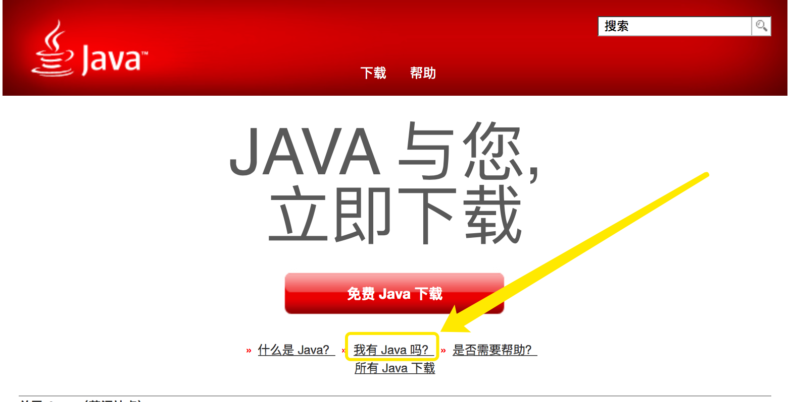
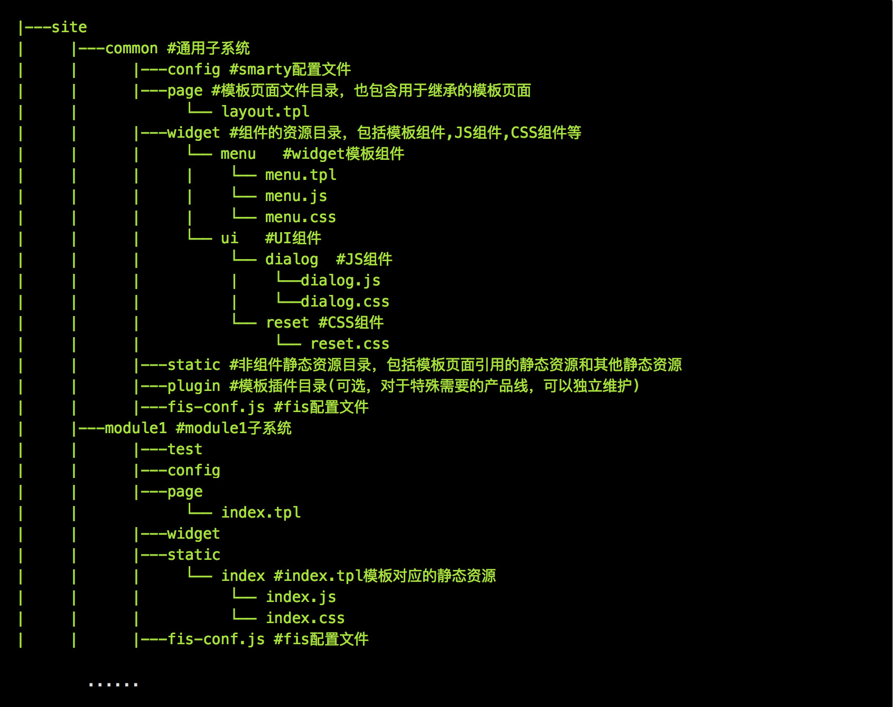
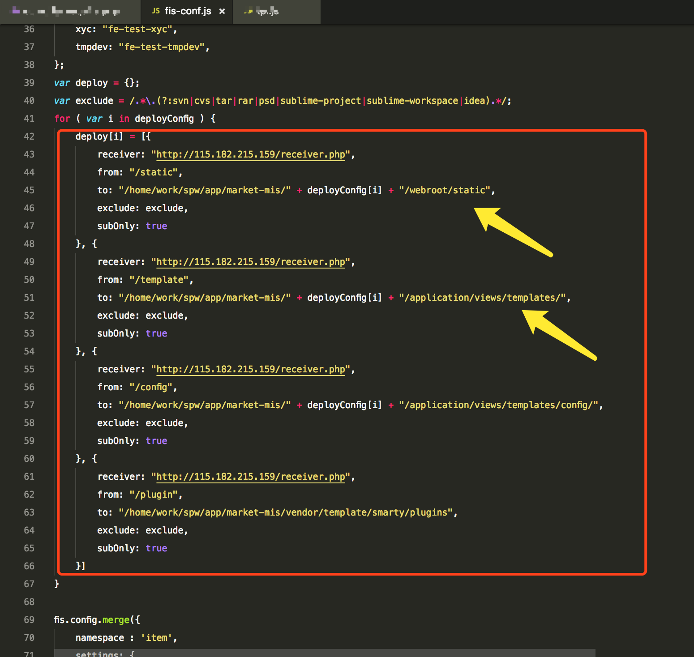
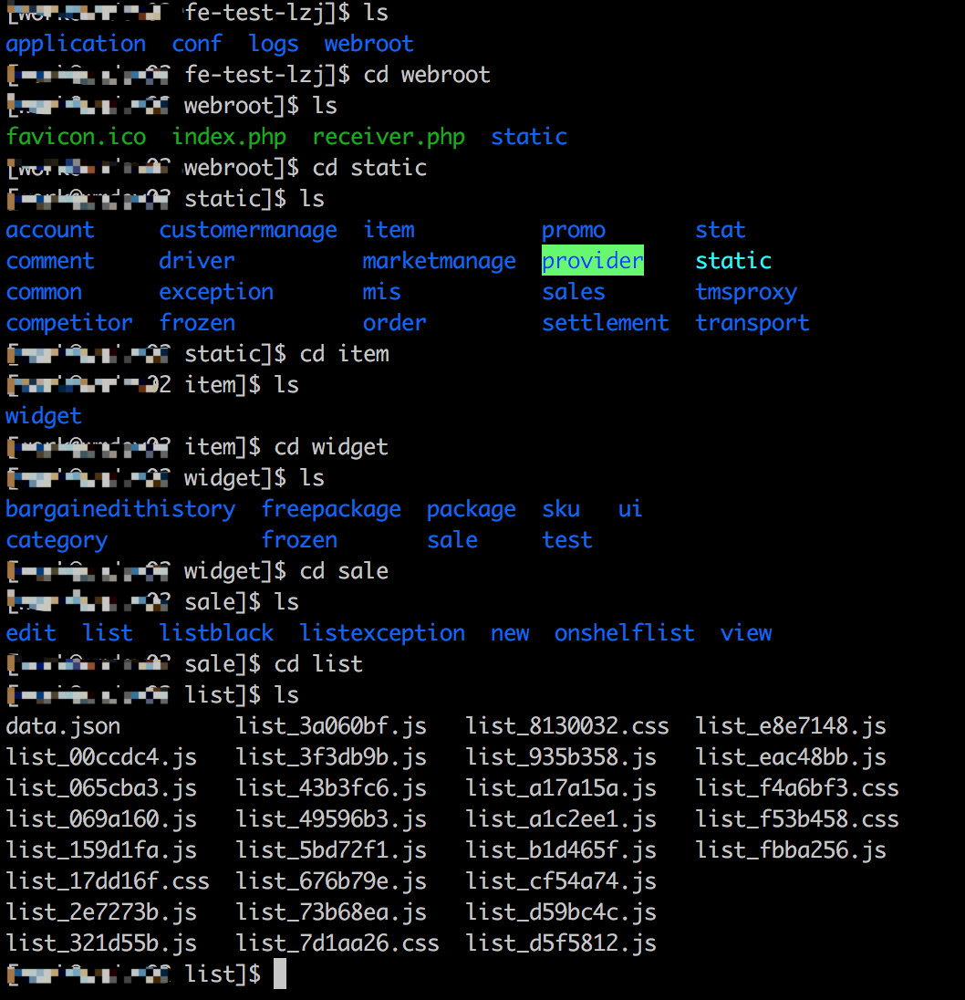
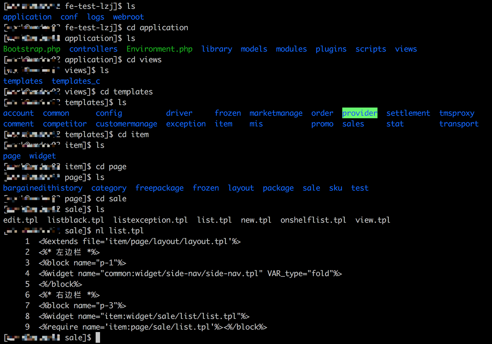
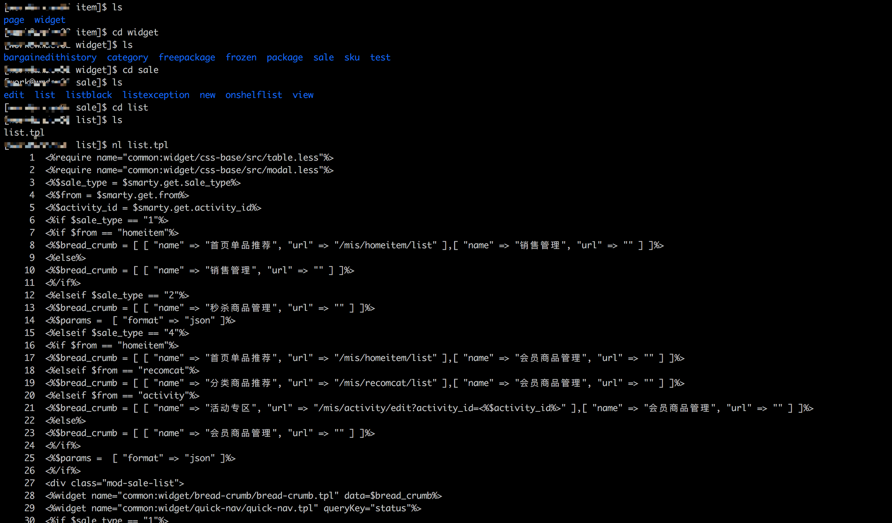
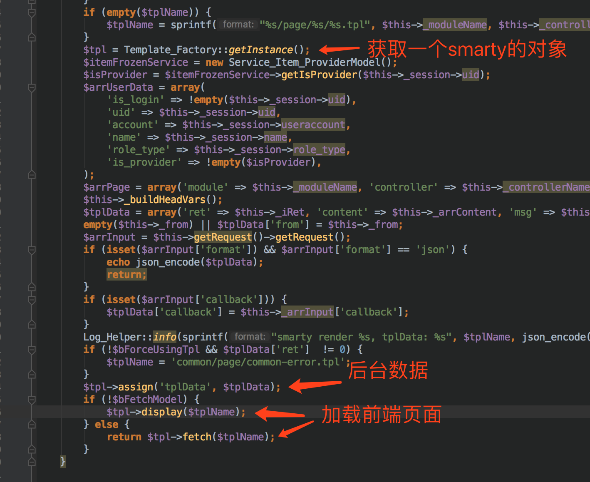

## FIS
### server：
    fis server start
    fis server stop
    fis server open

### fis release

默认目录：~/.fis-tmp

#### 参数：
    --optimize / -o

资源压缩，仅仅是压缩！！！去空格及换行符啥的

    --md5 / -m

为静态资源加版本号，类似于时间戳啦～（以前手动在引入文件后面手动加过?time=20170619这种时间戳的🙋）,

但是这个跟时间戳还是有本质的区别的。可以理解为时间戳只是一个URL的属性，但是md5是URL的一部分（这个后缀好像是根据消息摘要算法得出的跟文件内容相关的）

    --pack / -p

资源合并（依赖fis-postpackager-simple插件打包）安装插件、fis_conf中配置打包规则并开启插件
也可开启自动合并

    --omp

---

## FIS3
> 项目根目录：FIS3 配置文件（默认fis-conf.js）所在的目录为项目根目录。

### 特点
1.资源定位：就是构建的时候会替换资源URL为绝对URL；这样开发就不需要关心外部路径，构建后的程序可移植性强

2.

### server：
    fis3 server start
    fis3 server stop
    fis3 server open

### fis3 release
默认目录：~/.fis3-tmp

#### 参数：

### fis-conf
1.

    fis.match(selector, props); //后面覆盖前面，属性追加

    useHash: true   //添加 md5 戳
    optimizer:  //压缩

2.

    fis.media() //多种状态功能，比如有些配置是仅供开发环境下使用，有些则是仅供生产环境使用的。

3.

    fis3 inspect <media>    // 查看特定 media 的分配情况

### 发布远端
FIS3 默认支持使用 HTTP 上传代码，首先需要在测试机部署上传接收脚本（或者服务）

---

## FISP

### 环境配置

#### Java环境
来说一说配置本地调试环境中踩的坑坑坑吧～（一切基于 MAC）

mac安装Java环境非常简单，直接打开[官网](https://java.com/zh_CN/)一个大大的button（免费Java下载）点击下载安装

如图，安装后可以根据这个看看是否安装成功

那么问题来了，这边测试安装成功了，在`fisp server start`的时候还是会报没有Java环境，提示你安装的。。。。。

然后找啊找

问题的原因呢，Java官方给解释了（细心找找就会发现的），Mac系统在macOS Sierra (10.12)之后会与Java的最新版本有不兼容的地方，至于哪里、为什么，请[看这里](https://java.com/zh_CN/download/faq/yosemite_java.xml)

解决办法：（敲黑板）去[这里](https://support.apple.com/kb/DL1572?locale=zh_CN)下载这个版本的Java安装，就可以啦

个人没有测试过直接安装这个版本可不可以哈。。。

说明&总结：
 * 此问题我发现于2018-6-29，以后Java发版本肯定是会考虑这个问题的；此时这个问题官方给的解释是适用于Java版本：7.0, 8.0
 * 这件事告诉我们，遇到问题呢，仔细看官方文档、Q&A、help之类的啊，像Java、Mac这样优秀的产品会分分钟考虑到用户的，你的问题，潜在的问题一般都会考虑到并给你解答的，我们要做的就是冷静，慢慢分析
 * 更多的启示：我们做产品的时候也要学习这种严谨，责任，注重用户体验的精神！！！

#### PHP环境
官方说要安装php-cgi

好吧，根据官方说的步骤安装php55（brew安装）

现在的日期是2018-6-29，php55已经out了，安装的时候应该会各种报错的，说是找不到。。。。`Error: No available formula with the name "php55"` （人家各种searching都没找到，我也不好吐槽啥了。。。😂）

好吧，那么我就安装现在能找得到的吧，所以装了个php70（这个php后面的数字是我猜的应该是跟版本号相关的哈。。。实际是不是没有深究）

OK，安装成功

上面的step把Java的问题解决了，然后再次`fisp server start`，尼玛！！！unsupported php-cgi environment 😔

so，我还必须得安装php55😭😭😭

[解决方案](https://www.jianshu.com/p/e58e8f52da13)

---

### fisp的一些基本理念

>fis是什么？ 作用？

>fisp是什么？ 作用？ 与fis什么关系？

* FIS 产生之初定位就是做一个 __内核__，提供一套 __编译体系__ 以及一套静态资源管理的 __设计思路__ 及其本地调试。编译体系可以简单通过配置 + 插件的方式任意扩展。
* FIS+ 就通过 __扩展__ 实现了一套适合于后端是 PHP+Smarty3 的编译体系，然后在后端实现了静态资源管理，提出了诸如quickling，i18n，fis-plus(default)之类的 __解决方案__。这块值得说明一下的是解决方案fis-plus其实它和编译体系的命令包取了相同的名字。
* fisp不是fis+，只是fis+的一种解决方案（取名失误），适用于后端是php/smarty的架构体系。（FIS-PLUS的广义与狭义理解）
* 假设 FIS 起初就是一个 kernel，无法跑起来，需要通过扩展的 FIS+ 才能跑起来会不会让大家更好理解。

### 模块
[^官方解释：]: 当前端代码很多时，不得不面临分组件，分页面。为了发布迭代方便，不得不把它们分为不同的 __子系统__。比如用户信息、首页、详情页等等。
* 模块  就是一个子系统，而在 fis 项目中用 namespace 和fis-conf.js来区分。每一个模块会有一个配置文件fis-conf.js，还会取名不同的namespace。这主要是为了区分模块之前的静态资源。

* FIS 规范定义了两类模块： common 模块 与 业务模块。

##### 目录说明：
* 站点(site)：一般指能独立提供服务，具有单独二级域名的产品线。如旅游产品线或者特大站点的子站点（lv.baidu.com）。

* 模块(module)：具有较清晰业务逻辑关系的功能业务集合，一般也叫系统子模块，多个子系统构成一个站点。

* 页面(page): 具有独立URL的输出内容，多个页面一般可组成子系统。(页面模板)

* 组件(widget)：能独立提供功能且能够复用的独立资源，它可以是独立的JS、CSS或者是由JS、CSS和页面组成的页面碎片。(组件化)

* 静态资源(static)：非组件资源目录，包括模板页面引用的静态资源和其他静态资源（favicon,crossdomain.xml等）。

* 插件(plugin): 模板插件目录(可选，对于特殊需要的产品线，可以独立维护)。

* 测试数据(test): 页面对应的测试数据目录。(和page下的模板相对应，表明哪个模板用哪个数据文件进行渲染)

* server.conf 这是一个很有用的文件，它里面可以配置url转发，可以方便在本地模拟ajax请求等。

### 组件&组件化

##### 组件化

* 模块的 widget 目录默认为组件目录，组件化按照代码的组织方式，分为以下三种：

    * CSS 组件：独立 css 代码片段。可以被其他 css，js，模板引用。

    * JS 组件：独立 js 代码片段，JS 组件可以封装 CSS 组件的代码。

    * 模板组件：涉及代码最多，有模板代码，JS 代码，css 代码和 HTML 代码。 建议，模板组件中的 js 仅被这个 widget 使用，保持 widget 的独立。

### 以MIS为例剖析fisp项目(TODO:做一些test，mis本地运行及test；远程某些目录的测试)

>1.前端编译及发布过程（前/后）

>2.前后端架构如何？前端架构与fisp，分离处和耦合处在哪里？

>3.如何实现模板到浏览器资源的解析，前台编译过程还是请求时渲染，渲染架构在前端还是后端？(TODO:具体的渲染过程)

>4.MIS中为什么没有用npm管理包？那插件及第三方组件的引用是如何实现的？  (原始的资源引入，没有用第三方插件管理工具)

编译及发布的包被整合到fisp中，页面所需组件及第三方插件是直接通过原始的资源引入

##### mis fis-config发布的配置(1)

##### mis资源目录及解析过程(2)

1.mis开发目录及线上效果

2.mis发布后前端资源目录（webroot）

3.mis发布后前端资源目录（page）

4.mis发布后前端资源目录（widget）

5.mis后端用smarty渲染页面（模板与数据） (TODO:fetch 和 display 的区别)

##### artTemplate 与 Smarty（3）

* MIS中js中的动态加载js中的字符串模板使用的是artTemplate模板

* Smarty体现在tpl文件中

* artTemplate是腾讯开源的前端模版引擎

* art template语法分为两种：一种是原生语法，一种是简洁语法，我觉得原生更好理解，只是加个<%%>,其他和写js没什么区别

* 当模版引擎解析到<%%>时，会把其中的字符串作为js代码来执行

---

__引用及参考资源__: 

[fis+官方文档](http://fex-team.github.io/fis-plus/document.html#%25E5%25BF%25AB%25E9%2580%259F%25E5%2585%25A5%25E9%2597%25A8)

[FIS 与 FIS-PLUS 的渊源](http://fex.baidu.com/blog/2014/03/fis-plus/) 

[artTemplate - GitHub](https://github.com/aui/art-template) 

[smarty手册](https://www.smarty.net/docs/zh_CN/) 

---

[^N2018-06-19]: 宠辱不惊，闲看庭前花开花落；去留无意，漫随天外云卷云舒。