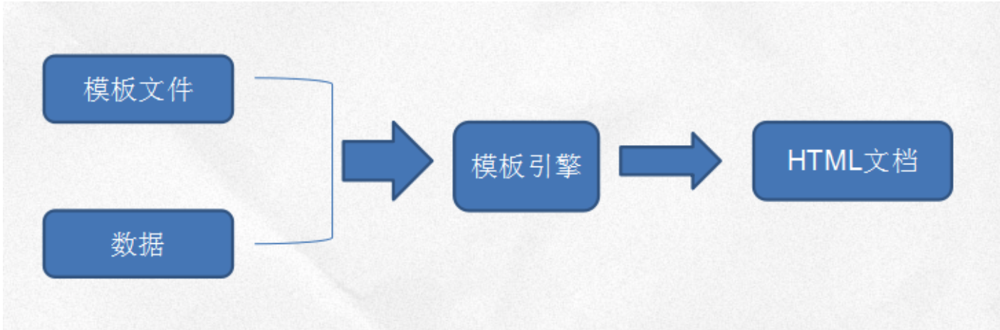

# BS Render - BS 架构中的渲染/加载/解析那些事儿

> 模版引擎 （Node:Nunjucks VS Browser:MVVM）    渲染时间、地点及效率

* 简单原理：
  

  访问文件
  加载模板引擎
  模板引擎去加载模板 
  _判断“缓存”_
  _编译模板_（逻辑代码和页面设计解析）
  返回/引入该编译后的文件
 
* 优点：
  * 通过编程元素（eg: 循环、条件分支），对数据的展现更具有控制力
  * 数据与展现分离，易于维护

* 种类
  * 前端（客户端）模版引擎-活的：主要结合js实现html，一种以handlebar mustache为 arttemplate代表，实现方式为拼字符串。另一种以react为代表，实现方式为virtual Dom （后来支持的服务端渲染？？？
  * 后端（服务端）模版引擎-死的：以velocity、smarty这种为代表，可结合Java、PHP等语言实现，由服务端生成html返回客户端。）   ：：：SEO，交互-重新编译/渲染代价大
  * node做中间层：后端接口跨端使用，SEO，前后端分离，不限前后端编译

* 根据服务器和客户端压力合理选择使用方案
  * 程序的那些部分主要是动态的？而哪些部分需要减少初始化加载的时间？
  * 需要把处理过程交给客户端？还是让服务器做这样的繁重工作？

> 三大MVVM框架的渲染/加载/解析， 传说中的react的服务器渲染， VUE的服务端框架-Nuxt.js （react的next）

> 顺带说说js怎么跑起来的(尼玛Java还需要JVM呢)： 为什么在服务器也能跑？ 端这边就不说了，肯定是有中间层的（Browser, wechat, webview/uiwebview,wkwebview）

> 再顺带说说请求这个事儿：静态资源,动态资源； GET,POST; HTTP请求结构(请求的解析) https://www.liaoxuefeng.com/wiki/0014316089557264a6b348958f449949df42a6d3a2e542c000/001432011939547478fd5482deb47b08716557cc99764e0000

> 再顺带说说BS和CS开发中使用请求（HTTP为例）有啥区别？为啥会有这些差异？

* 在生产环境下，静态资源是由部署在最前面的代理服务器（如Nginx）处理的，Node程序不需要处理静态文件。而在开发环境
  1. 可由koa处理（需要手动写处理程序）
  2. 手动配置一个反向代理服务器（项目复杂了）

* PS： 由于本引用、摘抄、个人融合比较混乱，没有单独列出参考资料啦